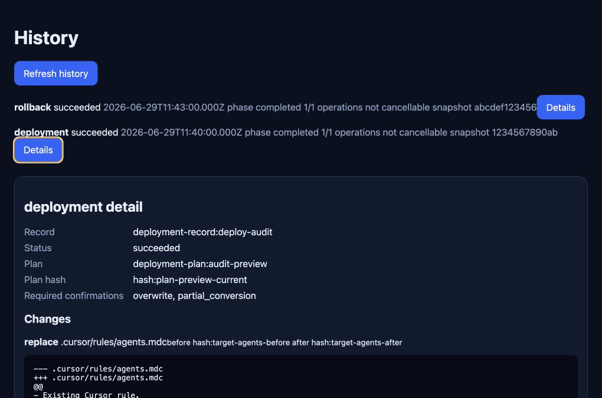

# AI Config Hub

Language: [简体中文](./README.md) | English

AI Config Hub is a local-first configuration hub for AI coding tools. It uses a unified domain model to read, interpret, diagnose, and migrate Rules, Agents, Skills, and MCP configuration across Claude Code, Cursor, Codex, and OpenCode. Its deployment workflow is previewable, backed up, verifiable, and rollback-aware, reducing the risk of overwriting user files when multiple tools and formats coexist.

### Background

AI coding tools are evolving with different directories, file formats, inheritance rules, and MCP configuration models. When individuals or teams move between Claude Code, Cursor, Codex, and OpenCode, they often face fragmented configuration, unclear effective behavior, lossy cross-tool migration, risky manual copying, and limited audit or rollback evidence.

AI Config Hub aims to provide unified local scanning, diagnostics, conversion, preview, deployment, and history without taking ownership of native tool files, executing third-party configuration scripts, or depending on a hosted cloud service.

### Overview

This repository is a modular TypeScript Monorepo. It contains a shared core, tool adapters, scanner, deployer, storage layer, central asset library, Git history and remote asset-repository support, plus CLI, Electron desktop, and local Web UI entry points.

Core principles:

- Local tool configuration files remain the source of truth; SQLite stores only rebuildable indexes, normalized results, diagnostics, and operation records.
- Scans are read-only by default and do not execute Skills, Hooks, MCP commands, or third-party scripts referenced by configuration.
- Writes must go through conversion, diff preview, user confirmation, drift checks, backups, atomic writes, rescan verification, and rollback on failure.
- Tool-specific behavior is isolated inside adapters, while the CLI and desktop app share the same core use cases and error semantics.
- The Electron renderer cannot access the filesystem, SQLite, Git, or shell directly; it only calls business-level APIs through an allowlisted preload IPC bridge.

### Visual Overview

#### Feature Flow


#### Interface Preview

The screenshots come from the current desktop workflow and are cropped so the local path bar is not shown.

| Asset scanning and diagnostics                                                                                 | Migration preview                                                                                            | History and rollback evidence                                                                                         |
| -------------------------------------------------------------------------------------------------------------- | ------------------------------------------------------------------------------------------------------------ | --------------------------------------------------------------------------------------------------------------------- |
|  |  |  |

#### Architecture Overview


### Features

- Multi-tool configuration scanning for Claude Code, Cursor, Codex, and OpenCode Rules, Agents, Skills, and MCP assets.
- Unified asset model that normalizes tool-specific files into `rule`, `agent`, `skill`, and `mcp` resources.
- Effective configuration resolution across user, project, and directory scopes, with inheritance, override, ignored asset, and contribution evidence.
- Diagnostics and reporting for parsing, compatibility, permissions, conflicts, drift, deployment, and verification issues.
- Conversion and migration preview with explicit full, partial, and unsupported outcomes, including retained, dropped, and transformed fields.
- Transactional deployment with structured operations, diffs, backups, atomic writes, verification, and verifiable rollback.
- Central asset library and Presets with a personal filesystem library, asset import, Preset definition, preview, apply, source tracking, and rollback records.
- Git asset repository workflows for clone, pull, commit, push, tag, restore, history, conflict status, and recovery guidance.
- Declarative custom tool configuration with safe internal tool IDs and declarative scan rules for Rules, Agents, Skills, or MCP configuration.
- Local history and Git evidence for deployment, rollback, and snapshot audit trails.
- Multiple entry points through the `apps/cli` Node.js CLI, the `apps/desktop` Electron + React desktop app, and the `apps/web` local Web UI over the Local API.

See [docs/implementation/phase-status.md](./docs/implementation/phase-status.md) for the current implementation status. Diagnostics, conversion, deployment, the central asset library, Git asset repository primitives, Local API, local Web UI, and three-platform packaging are covered for the current tracked scope; team identity, approval flows, hosted collaboration services, and online sharing markets remain outside the MVP boundary.

### Development Setup

This project requires Node.js `>=24 <25` and declares `pnpm@11.5.3` as its package manager. Use `fnm` to pin the local Node version:

```bash
fnm install 24
fnm use 24
node --version
```

Enable Corepack and install dependencies:

```bash
corepack enable
corepack prepare pnpm@11.5.3 --activate
pnpm install --frozen-lockfile
```

If Vitest, Vite, Rolldown, or other tooling fails with missing modern `node:*` exports, first confirm the active shell is using Node 24:

```bash
node --version
pnpm --version
```

### Common Commands

```bash
pnpm typecheck
pnpm lint
pnpm test
pnpm build
```

Additional scripts:

```bash
pnpm dev
pnpm test:integration
pnpm test:e2e
pnpm package
pnpm package:macos:arm64
pnpm package:windows:x64
pnpm package:linux:x64
```

### Repository Structure

- `packages/shared`: cross-layer primitives such as stable IDs, paths, hashes, and redacted errors.
- `packages/core`: contracts for normalized assets, scopes, effective configuration, diagnostics, conversion, deployment, and tasks.
- `packages/api`: versioned commands, IPC envelopes, event protocols, and browser-safe clients.
- `packages/adapters`: tool adapters for Claude Code, Cursor, Codex, and OpenCode.
- `packages/scanner`: safe reads, hashing, scan orchestration, and incremental change detection.
- `packages/deployer`: diffs, drift checks, backups, atomic writes, verification, and rollback.
- `packages/storage`: SQLite repositories, migrations, and transaction boundaries.
- `packages/git`: local Git snapshots, history, and recovery evidence.
- `packages/asset-library`: personal central asset library, Presets, and asset source tracking.
- `packages/local-api`: local HTTP/SSE API, authentication, and origin restrictions.
- `apps/cli`: Node.js CLI over the shared core use cases.
- `apps/desktop`: Electron + React desktop application.
- `apps/web`: local Web UI that reaches core capabilities through the Local API.

### Documentation

- [Architecture overview](./docs/architecture/overview.md)
- [Domain model](./docs/architecture/domain-model.md)
- [Adapter system](./docs/architecture/adapter-system.md)
- [API and IPC](./docs/architecture/api-and-ipc.md)
- [Security design](./docs/architecture/security.md)
- [Implementation status](./docs/implementation/phase-status.md)
