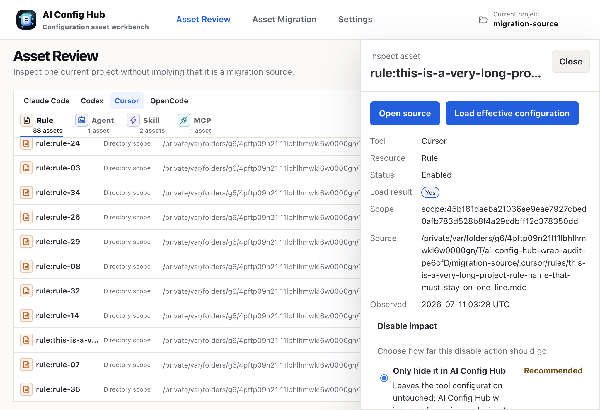

# AI Config Hub

Language: [简体中文](./README.md) | English

AI Config Hub is a local-first configuration workbench for AI coding tools. It uses one domain model to scan, diagnose, explain, and migrate Rules, Agents, Skills, and MCP configuration across Claude Code, Cursor, Codex, and OpenCode. The current product experience is centered on the Electron desktop app: choose a project and review assets, choose source and target projects for migration, preview writes, then explicitly confirm before verified configuration files are written.

### Problems It Solves

Choosing an AI coding tool is rarely a one-time decision. A Claude Code account being banned, OpenCode introducing a cheaper Go plan, Cursor plans feeling expensive, or even a single top-down company decision can force teams to jump back and forth between IDEs and AI coding tools. Many users also run multiple IDEs at the same time to compare models, agents, rules, MCP integrations, and workflows. When they need to carry previous configuration, prompt assets, and project knowledge into another tool, each product's directory layout, file format, inheritance rules, and disable mechanism make manual migration complex and error-prone.

Another common problem is figuring out why an AI IDE unexpectedly invokes a tool in a specific directory. The cause is often not random model behavior, but a tool-specific configuration loading mechanism: for example, Claude Code may load asset configuration from multiple directory levels, while Cursor, Codex, and OpenCode each have their own scopes, precedence, and ignore rules. Without deep knowledge of the IDE, it is hard to locate which asset was loaded and from which path; after locating it, safely disabling it and confirming the final effective configuration becomes another debugging task.

### Solution Overview

AI Config Hub scans Rules, Agents, Skills, and MCP configuration scattered across different IDEs and directory levels into one reviewable asset model. It explains each asset's source path, scope, load state, contributor relationships, and diagnostics. During migration, it first produces a cross-tool conversion preview that shows which fields will be preserved, transformed, or dropped, then uses hash checks, drift detection, backups, verification, and rollback to help users safely migrate and govern configuration across Claude Code, Cursor, Codex, and OpenCode.

It is not a simple file sync tool. Before writing, AI Config Hub surfaces target impact, field loss, hash snapshots, drift risk, and required confirmations, then reduces migration risk through backups, verification, history records, and rollback APIs.

### Current Experience

The current code version is `0.2.18`. The Electron desktop app is the most complete UX entry point, with three workspaces in its sidebar:

- **Asset Review**: select a current project and scan automatically; browse Rules, Agents, Skills, and MCP by tool and resource type; inspect scope, source, loaded/covered/disabled state, and diagnostic counts. Workspace diagnostics can be filtered by severity and diagnostic code, then located back to the associated asset.
- **Asset Migration**: choose or swap source and target projects independently, compare both sides, and select source assets, a target tool, and a `fail`, `replace`, or `merge` conflict policy. Every migration must create a preview before hashes, field loss, and overwrite/delete risks are confirmed for execution.
- **Settings**: configure system/light/dark theme and English/Simplified Chinese language; selectively clear scan cache, deployment history, or preferences without deleting project configuration or recovery backups. Packaged Windows and Linux builds can also check for, download, and restart to install updates.

The asset detail dialog can open a source, choose an appropriate enable/disable method, inspect normalized content and references, and load effective configuration. Effective resolution explains inherited, merged, and overridden contributors; ignored assets and covering relationships; diagnostics; and the snapshot revision.

Skills are handled as complete directory packages rather than only as a `SKILL.md` file. Asset Review summarizes file, folder, text, and binary counts and shows the package tree. Migration generates the target `SKILL.md`, copies text and binary support files, and checks package-wide hashes and drift. The move-file disablement method moves the entire Skill directory package and allows it to be restored.

Scans report phases, progress, and item failures, and can be cancelled before the index commit begins. The desktop app watches scanned roots by default and incrementally refreshes the index; changes affecting either side of a migration retire stale previews. After a renderer reload, the app also attempts to reconnect to active scan, deployment, or rollback tasks.

### Visual Overview

#### Feature Flow


#### Current Desktop Workflow

The screenshots use a sanitized demo project, the English light theme, and the 1024 × 700 minimum desktop window.

| Asset review and diagnostics                                                                                                                 | Asset detail and long identifiers                                                                                                       |
| -------------------------------------------------------------------------------------------------------------------------------------------- | --------------------------------------------------------------------------------------------------------------------------------------- |
|       |  |
| **Migration preview and confirmations**                                                                                                      | **Settings and local data**                                                                                                             |
|  |                      |

#### Architecture Overview


### Implemented Capabilities

| Capability                | Current implementation                                                                                                                                                                                                                                                  |
| ------------------------- | ----------------------------------------------------------------------------------------------------------------------------------------------------------------------------------------------------------------------------------------------------------------------- |
| Multi-tool model          | Built-in adapters for Claude Code, Cursor, Codex, and OpenCode normalize tool-specific files into `rule`, `agent`, `skill`, and `mcp`, preserving user/project/directory scope, native identity, source files, content hashes, and diagnostic evidence.                 |
| Scanning and indexing     | Full and incremental scans, tool filters, path-boundary and symlink-escape protection, cancellation, phase progress, partial-success summaries, file watching, and automatic incremental refresh. Scanning does not execute Skills, MCP servers, or referenced scripts. |
| Asset review              | Logical keys, scopes, source summaries, load state, diagnostic counts, and detail; external-editor opening; severity/code diagnostic filters and location; normalized content, references, and complete Skill package trees.                                            |
| Effective configuration   | Tool-specific precedence resolution returns final configuration, inherited/merged/overridden contributors, ignored or covered assets, effective diagnostics, and a snapshot revision.                                                                                   |
| Asset enablement          | Depending on the asset and tool, disable through a native switch, move a file or whole Skill package, remove a configuration entry, or ignore only in the Hub; persist recovery records and enable again.                                                               |
| Diagnostics and reports   | Parsing, Skill metadata/reference/size limits, compatibility, permission, conflict, literal-secret risk, drift, deployment, and verification diagnostics. CLI/API reports support project, tool, severity, and time filters with JSON or Markdown export.               |
| Migration preview         | Cross-tool compatibility and retained/transformed/dropped fields; package-grouped file changes, diffs, source/target hashes, difference summaries, required confirmations, and expiry. Plans support generated-file, copy, and symlink operations.                      |
| Controlled writes         | Only fresh previews with a matching plan hash execute; source/target drift and overwrite/partial-conversion/delete confirmations are rechecked. Execution uses path locks, backups, atomic writes, rescan verification, and compensation on failure.                    |
| History and recovery      | CLI/API deployment and rollback history, detail, rollback execution, task events, and local Git snapshot evidence. Rollback checks current targets and backup integrity. Unsafe failures activate a recovery lock that blocks later deployment.                         |
| Settings and distribution | Theme, language, revision-conflict protection, and controlled local-data clearing; Windows x64 NSIS, macOS x64/arm64 DMG, and Linux x64 AppImage packaging with checksums, SBOMs, and release evidence. Linux retains a glibc 2.28 compatibility audit.                 |

#### Entry-point coverage and boundaries

- **Desktop**: asset review, effective configuration, migration preview/deployment, and settings. There is currently no History workspace in the sidebar; rollback and complete history queries are primarily exposed through CLI/API.
- **CLI**: scanning and status lookup, asset query and enablement, effective configuration, diagnostics/export, migration preview, deployment, history, and rollback for automation, CI, and audit.
- **Local API / Web UI**: `packages/local-api` is an embeddable local HTTP/SSE server library. It binds to loopback by default and enforces Bearer authentication, Origin restrictions, and no-store responses. `apps/web` is currently a lightweight client for connecting to an already-running Local API, scanning, listing assets, and viewing task events; the repository does not yet provide a standalone Local API launch command.
- **Library-level capabilities**: `packages/asset-library` implements a personal central asset library, source tracking, and Preset preview/application. `packages/git` implements remote Git asset-repository primitives. These are tested foundation libraries, but are not yet wired into desktop or CLI user workflows.

The normalized model currently excludes other tool asset families such as Hooks, Commands, and Plugins, and conversion is not guaranteed to preserve every field losslessly. Fields that cannot be represented are reported as partial compatibility, transformations, or dropped-field evidence in the preview. Team identity, approval flows, hosted collaboration services, and online sharing markets remain outside the MVP boundary.

See [docs/implementation/phase-status.md](./docs/implementation/phase-status.md) for implementation evidence. “Complete” there refers to the tracked code/test scope, not to every capability having a complete user interface.

### CLI

The CLI exposes shared core use cases and is useful for scripting, CI checks, and audit:

```bash
ai-config-hub scan <roots...>
ai-config-hub scan status <task-id>
ai-config-hub assets list --tool claude-code
ai-config-hub assets get <asset-id> --include normalized --include diagnostics
ai-config-hub assets disable <asset-id> --method move_file
ai-config-hub assets enable <asset-id>
ai-config-hub effective --tool claude-code --project <project-id> --scope <scope-id>
ai-config-hub diagnose --severity error --code <diagnostic-code>
ai-config-hub diagnose export --format markdown
ai-config-hub migrate --dry-run --asset <asset-id> --to cursor --scope <target-scope>
ai-config-hub deploy <plan-id> --plan-hash <hash> --confirm overwrite --yes
ai-config-hub history --kind deployment
ai-config-hub rollback <deployment-id> --yes
```

All major CLI commands support `--json`. `migrate` only creates a preview plan; actual writes must be explicitly confirmed through `deploy`. Pass each value returned in `requiredConfirmations` through `--confirm`; possible values are `partial_conversion`, `overwrite`, and `delete`. The sample uses `overwrite` only to illustrate a plan with overwrite risk.

### Local API And Web UI

`packages/local-api` provides an embeddable local HTTP/SSE API with authentication and origin restrictions. `apps/web` is a lightweight Local API client for entering the URL and token of an already-running server, starting scans, refreshing assets, and viewing task events. The repository currently has no standalone Local API server launch command; the complete review and migration workflow lives in the desktop app.

### Design Principles

- Local configuration files remain the source of truth; SQLite stores only rebuildable indexes, normalized results, diagnostics, and operation records.
- Scans are read-only by default and do not execute Skills, Hooks, MCP commands, or third-party scripts referenced by configuration.
- Writes must go through conversion, diff preview, user confirmation, drift checks, backups, atomic writes, rescan verification, and rollback on failure.
- Tool-specific behavior is isolated inside adapters, while the CLI, desktop app, and Local API share the same core use cases and error semantics.
- The Electron renderer cannot access the filesystem, SQLite, Git, or shell directly; it only calls business-level APIs through an allowlisted preload IPC bridge.

### Development Setup

This project requires Node.js `>=24 <25` and declares `pnpm@11.5.3` as its package manager. Use `fnm` to pin the local Node version:

```bash
fnm install 24
fnm use 24
node --version
```

Enable Corepack and install dependencies:

```bash
corepack enable
corepack prepare pnpm@11.5.3 --activate
pnpm install --frozen-lockfile
```

If Vitest, Vite, Rolldown, or other tooling fails with missing modern `node:*` exports, first confirm the active shell is using Node 24:

```bash
node --version
pnpm --version
```

### Common Commands

```bash
pnpm typecheck
pnpm lint
pnpm test
pnpm build
```

Additional scripts:

```bash
pnpm dev
pnpm test:integration
pnpm test:e2e
pnpm package
pnpm package:macos:arm64
pnpm package:windows:x64
pnpm package:linux:x64
```

### Repository Structure

- `packages/shared`: cross-layer primitives such as stable IDs, paths, hashes, and redacted errors.
- `packages/core`: contracts for normalized assets, scopes, effective configuration, diagnostics, conversion, deployment, and tasks.
- `packages/api`: versioned commands, IPC envelopes, event protocols, and browser-safe clients.
- `packages/adapters`: tool adapters for Claude Code, Cursor, Codex, and OpenCode.
- `packages/scanner`: safe reads, hashing, scan orchestration, and incremental change detection.
- `packages/deployer`: diffs, drift checks, backups, atomic writes, verification, and rollback.
- `packages/storage`: SQLite repositories, migrations, and transaction boundaries.
- `packages/git`: local Git snapshots, history, and recovery evidence.
- `packages/asset-library`: personal central asset library, Presets, and asset source tracking.
- `packages/local-api`: local HTTP/SSE API, authentication, and origin restrictions.
- `apps/cli`: Node.js CLI over the shared core use cases.
- `apps/desktop`: Electron + React desktop application.
- `apps/web`: local Web UI that reaches core capabilities through the Local API.

### Documentation

- [Architecture overview](./docs/architecture/overview.md)
- [Domain model](./docs/architecture/domain-model.md)
- [Adapter system](./docs/architecture/adapter-system.md)
- [API and IPC](./docs/architecture/api-and-ipc.md)
- [Security design](./docs/architecture/security.md)
- [Implementation status](./docs/implementation/phase-status.md)
