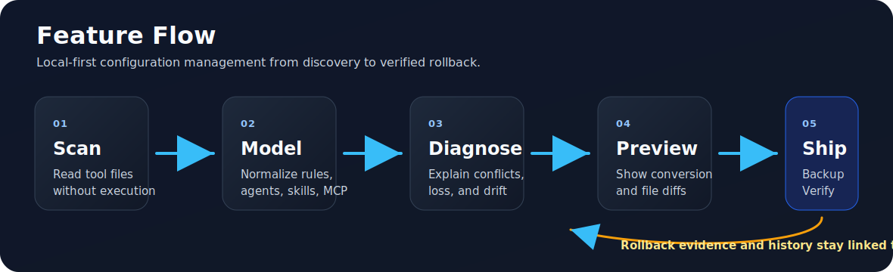
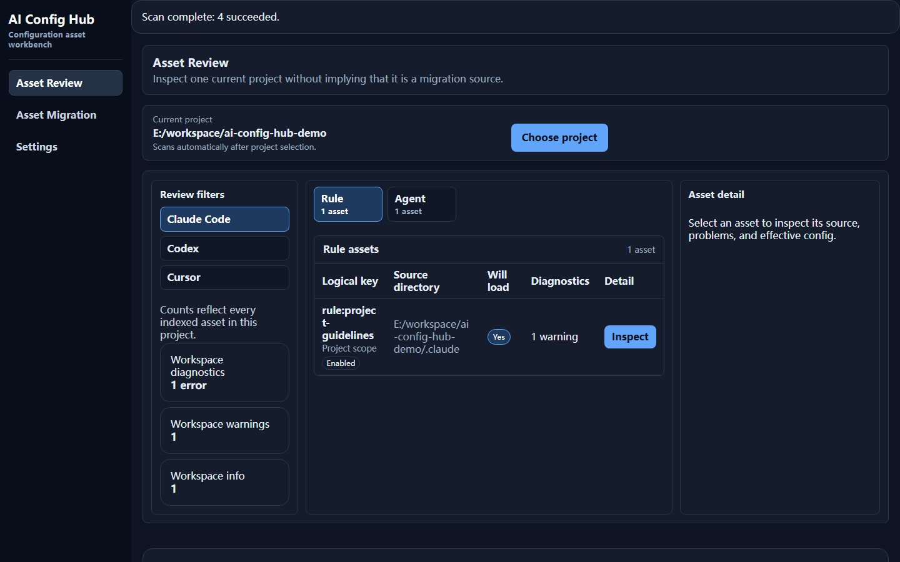
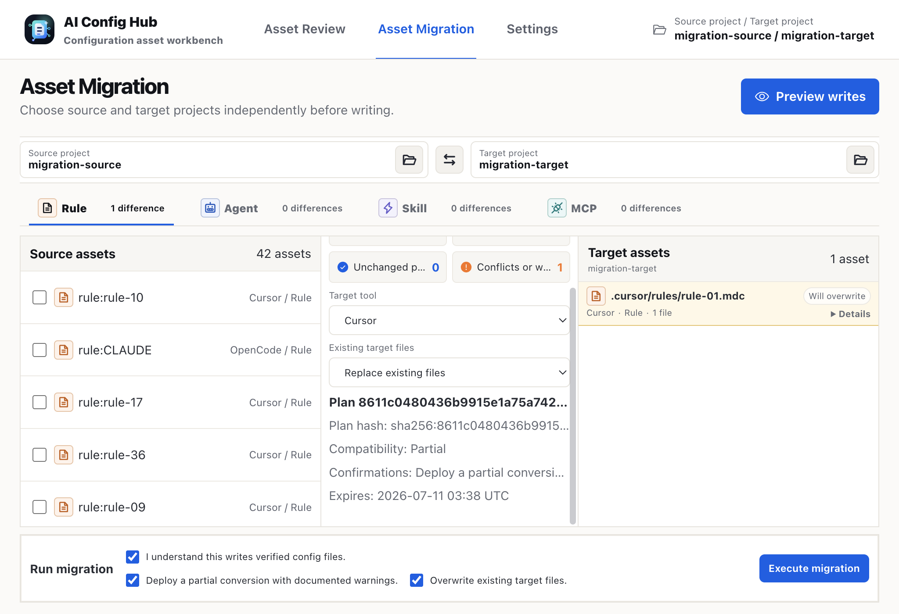
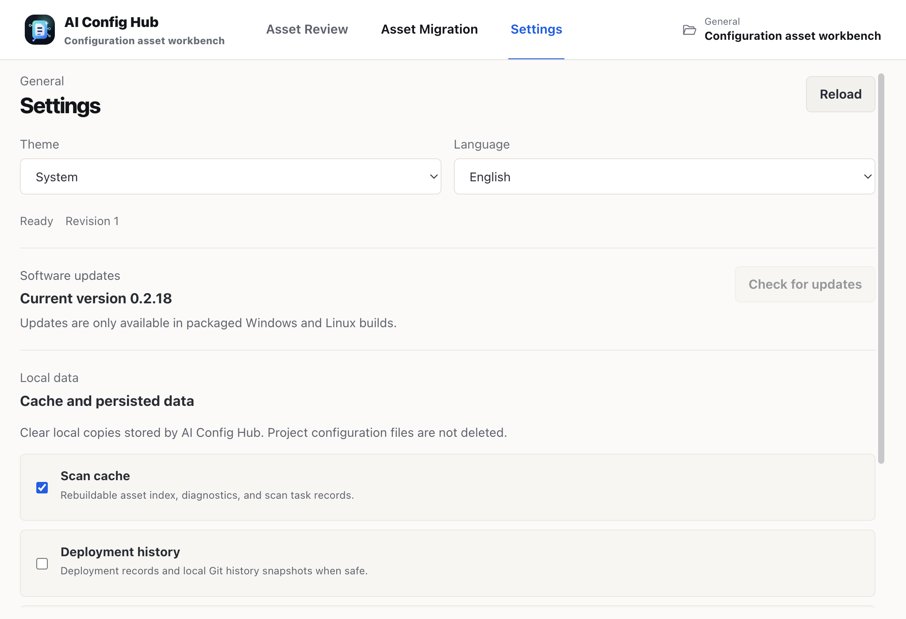
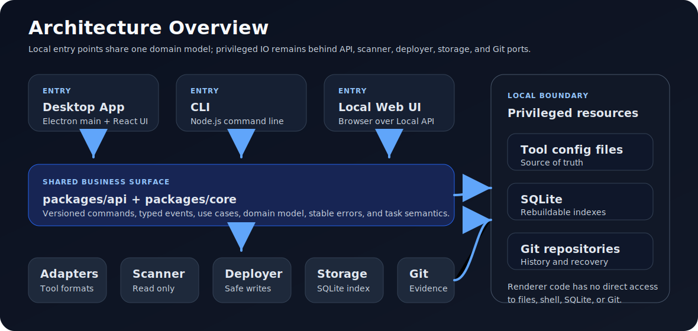

# AI Config Hub

语言：简体中文 | [English](./README.en.md)

AI Config Hub 是一个本地优先的 AI 编程工具配置工作台，用统一模型扫描、诊断、解释和迁移 Claude Code、Cursor、Codex 与 OpenCode 的 Rules、Agents、Skills 和 MCP 配置。当前产品体验以 Electron 桌面端为主：先选择项目并审查资产，再选择源/目标项目预览迁移，最后在明确确认后写入可验证的配置文件。

### 解决的痛点

AI 编程工具的选择很少是一次性决定。Claude Code 账号被封禁、OpenCode 推出更便宜实惠的 Go 套餐、Cursor 套餐价格偏高，甚至公司内部某个上层决策，都可能让团队被迫在不同 IDE 和 AI 编程工具之间反复横跳。很多人也会同时使用多个 IDE 来对比模型、Agent、Rules、MCP 与工作流差异；一旦想把既有配置、提示词资产和项目经验迁移过去，就会发现每个工具的目录结构、文件格式、继承规则和禁用方式都不一样，手工复制既麻烦又容易漏。

另一个常见问题是“为什么这个目录下的 AI IDE 会莫名其妙调用某个工具”。这往往不是模型突然失控，而是工具独有的配置加载机制在生效：例如 Claude Code 可能会从多个层级加载资产配置，Cursor、Codex、OpenCode 又各有自己的作用域、优先级和忽略规则。如果不了解对应 IDE，很难定位到底加载了哪个资产、来自哪个路径；即使找到了路径，如何安全禁用、如何判断禁用后最终配置是否变化，又会变成新的排查成本。

### 解决方案简述

AI Config Hub 把分散在不同 IDE、不同目录层级里的 Rules、Agents、Skills 和 MCP 配置统一扫描成可审查的资产模型，解释每个资产的来源路径、作用域、加载状态、贡献关系和诊断问题；在迁移时先生成跨工具转换预览，明确哪些字段会保留、转换或丢失，再通过哈希校验、漂移检查、备份、验证和回滚，帮助用户安全地在 Claude Code、Cursor、Codex 与 OpenCode 之间迁移和治理配置。

它不是简单的文件同步工具。AI Config Hub 会在写入前展示目标影响、字段丢失、哈希快照、漂移风险和必需确认项，并通过备份、验证、历史记录和回滚接口降低跨工具迁移时覆盖本地配置的风险。

### 当前体验

桌面端是当前最完整的 UX 入口，左侧导航包含三个工作区：

- **Asset Review（资产审查）**：选择当前项目后自动扫描配置资产，按工具和资源类型筛选 Rules、Agents、Skills、MCP；查看逻辑键、来源目录、是否会加载、诊断数量和资产详情。
- **Asset Migration（资产迁移）**：独立选择源项目和目标项目，选择源资产、目标工具和冲突策略，先生成写入预览，再在确认哈希、字段损失、覆盖/删除等风险后执行迁移。
- **Settings（设置）**：配置主题和语言，支持跟随系统、浅色、深色，以及英文/简体中文界面。

桌面端的资产详情对话框支持打开来源文件、启用/禁用资产、加载有效配置，并展示标准化内容、引用、贡献者、被忽略资产和有效配置诊断。迁移页会在执行前展示差异摘要、目标文件变更、字段保留/丢弃/转换、源漂移、源/目标哈希快照和任务执行状态。

### 图示概览

#### 功能流程



#### 当前桌面工作流

截图来自桌面端审查和迁移流程，并已裁剪掉本机路径栏。

| 资产审查 | 迁移预览 | 设置 |
| --- | --- | --- |
|  |  |  |

#### 架构概览



### 已实现能力

- 多工具扫描：发现 Claude Code、Cursor、Codex 和 OpenCode 的 Rules、Agents、Skills、MCP 配置资产。
- 统一资产模型：将工具专属文件解析为 `rule`、`agent`、`skill`、`mcp` 等通用资源，并保留来源、作用域、哈希和诊断信息。
- 资产审查：按工具、资源类型、作用域和诊断情况查看资产；支持打开来源文件、启用/禁用资产和定位诊断。
- 有效配置解释：解析贡献者、继承、合并、覆盖、被忽略资产和有效配置诊断，帮助判断“最终会生效什么”。
- 诊断与报告：覆盖解析、兼容性、权限、冲突、明文密钥风险、漂移、部署和验证问题；CLI 支持导出诊断。
- 迁移预览：跨工具生成计划、diff、兼容性结果、字段损失、源/目标哈希和目标影响。
- 受控部署：部署必须基于未过期的预览计划哈希，并通过覆盖、部分转换、删除等必需确认项后才会写入。
- 恢复证据：CLI 和 API 支持部署/回滚历史、回滚执行、任务事件和本地 Git 快照证据。
- 设置与本地化：桌面端支持主题、语言和设置修订版本；当前界面提供英文与简体中文。
- 多入口：桌面端用于主要交互工作流，CLI 用于自动化与审计，本地 Web UI 用于连接 Local API、触发扫描、查看资产和任务事件。

当前实现状态见 [docs/implementation/phase-status.md](./docs/implementation/phase-status.md)。诊断、转换、部署、中央资产库、Git 资产库基础工作流、本地 API、本地 Web UI 和三平台打包已覆盖当前 tracked scope；团队身份、审批流、托管协作服务和在线分享市场仍在 MVP 边界外。

### 命令行入口

CLI 暴露与桌面端共享的核心用例，适合脚本化、CI 检查和审计：

```bash
ai-config-hub scan <roots...>
ai-config-hub assets list --tool claude-code
ai-config-hub assets get <asset-id> --include normalized --include diagnostics
ai-config-hub effective --tool claude-code --project <project-id> --scope <scope-id>
ai-config-hub diagnose --severity error
ai-config-hub diagnose export --format markdown
ai-config-hub migrate --dry-run --asset <asset-id> --to cursor --scope <target-scope>
ai-config-hub deploy <plan-id> --plan-hash <hash> --yes
ai-config-hub history --kind deployment
ai-config-hub rollback <deployment-id> --yes
```

所有主要 CLI 命令都支持 `--json` 输出。`migrate` 只生成预览计划；实际写入必须通过 `deploy` 显式确认。

### 本地 API 与 Web UI

`packages/local-api` 提供本机 HTTP/SSE API、认证和来源限制。`apps/web` 是轻量 Local API 客户端，当前用于输入本机 API 地址和 token、触发扫描、刷新资产列表并查看任务事件。完整审查和迁移体验以桌面端为准。

### 设计原则

- 本地配置文件是事实来源；SQLite 只保存可重建的索引、规范化结果、诊断和操作记录。
- 扫描默认只读，不执行 Skill、Hook、MCP 命令或配置中引用的第三方脚本。
- 写入必须经过转换、差异预览、用户确认、漂移检查、备份、原子写入、重新扫描验证和失败回滚。
- 工具差异隔离在适配器内，CLI、桌面端和 Local API 共享同一套核心用例和错误语义。
- Electron renderer 不直接访问文件系统、SQLite、Git 或 shell，只通过白名单 preload IPC 调用业务级 API。

### 开发环境准备

本项目要求 Node.js `>=24 <25`，仓库声明的包管理器为 `pnpm@11.5.3`。建议使用 `fnm` 固定本地 Node 版本：

```bash
fnm install 24
fnm use 24
node --version
```

启用 Corepack 并安装依赖：

```bash
corepack enable
corepack prepare pnpm@11.5.3 --activate
pnpm install --frozen-lockfile
```

如果 Vitest、Vite、Rolldown 或其他工具提示缺少现代 `node:*` 导出，先确认当前 shell 已切换到 Node 24：

```bash
node --version
pnpm --version
```

### 常用开发命令

```bash
pnpm typecheck
pnpm lint
pnpm test
pnpm build
```

其他常用脚本：

```bash
pnpm dev
pnpm test:integration
pnpm test:e2e
pnpm package
pnpm package:macos:arm64
pnpm package:windows:x64
pnpm package:linux:x64
```

### 项目结构

- `packages/shared`：稳定 ID、路径、哈希和脱敏错误等跨层原语。
- `packages/core`：规范化资产、作用域、生效配置、诊断、转换、部署与任务契约。
- `packages/api`：版本化命令、IPC envelope、事件协议和浏览器安全客户端。
- `packages/adapters`：Claude Code、Cursor、Codex、OpenCode 的工具适配器。
- `packages/scanner`：安全读取、哈希、扫描编排和增量变化检测。
- `packages/deployer`：差异、漂移检查、备份、原子写入、验证和回滚。
- `packages/storage`：SQLite 仓储、迁移和事务边界。
- `packages/git`：本地 Git 快照、历史和恢复证据。
- `packages/asset-library`：个人中央资产库、Preset 和资产来源追踪。
- `packages/local-api`：本机 HTTP/SSE API、认证和来源限制。
- `apps/cli`：共享核心用例的 Node.js CLI。
- `apps/desktop`：Electron + React 桌面应用。
- `apps/web`：通过 Local API 连接核心能力的本地 Web UI。

### 相关文档

- [架构总览](./docs/architecture/overview.md)
- [领域模型](./docs/architecture/domain-model.md)
- [适配器系统](./docs/architecture/adapter-system.md)
- [API 与 IPC](./docs/architecture/api-and-ipc.md)
- [安全设计](./docs/architecture/security.md)
- [实现状态](./docs/implementation/phase-status.md)
