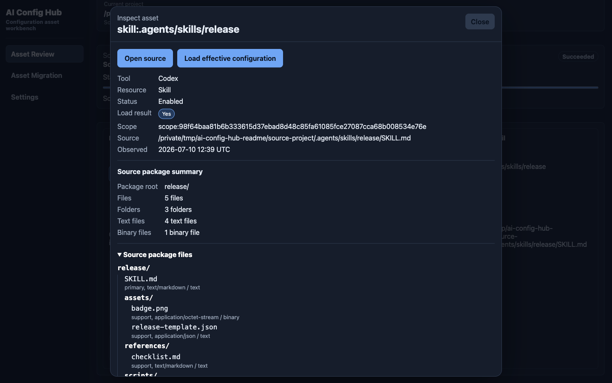

# AI Config Hub

语言：简体中文 | [English](./README.en.md)

AI Config Hub 是一个本地优先的 AI 编程工具配置工作台，用统一模型扫描、诊断、解释和迁移 Claude Code、Cursor、Codex 与 OpenCode 的 Rules、Agents、Skills 和 MCP 配置。当前产品体验以 Electron 桌面端为主：先选择项目并审查资产，再选择源/目标项目预览迁移，最后在明确确认后写入可验证的配置文件。

### 解决的痛点

AI 编程工具的选择很少是一次性决定。Claude Code 账号被封禁、OpenCode 推出更便宜实惠的 Go 套餐、Cursor 套餐价格偏高，甚至公司内部某个上层决策，都可能让团队被迫在不同 IDE 和 AI 编程工具之间反复横跳。很多人也会同时使用多个 IDE 来对比模型、Agent、Rules、MCP 与工作流差异；一旦想把既有配置、提示词资产和项目经验迁移过去，就会发现每个工具的目录结构、文件格式、继承规则和禁用方式都不一样，手工复制既麻烦又容易漏。

另一个常见问题是“为什么这个目录下的 AI IDE 会莫名其妙调用某个工具”。这往往不是模型突然失控，而是工具独有的配置加载机制在生效：例如 Claude Code 可能会从多个层级加载资产配置，Cursor、Codex、OpenCode 又各有自己的作用域、优先级和忽略规则。如果不了解对应 IDE，很难定位到底加载了哪个资产、来自哪个路径；即使找到了路径，如何安全禁用、如何判断禁用后最终配置是否变化，又会变成新的排查成本。

### 解决方案简述

AI Config Hub 把分散在不同 IDE、不同目录层级里的 Rules、Agents、Skills 和 MCP 配置统一扫描成可审查的资产模型，解释每个资产的来源路径、作用域、加载状态、贡献关系和诊断问题；在迁移时先生成跨工具转换预览，明确哪些字段会保留、转换或丢失，再通过哈希校验、漂移检查、备份、验证和回滚，帮助用户安全地在 Claude Code、Cursor、Codex 与 OpenCode 之间迁移和治理配置。

它不是简单的文件同步工具。AI Config Hub 会在写入前展示目标影响、字段丢失、哈希快照、漂移风险和必需确认项，并通过备份、验证、历史记录和回滚接口降低跨工具迁移时覆盖本地配置的风险。

### 当前体验

当前代码版本为 `0.2.18`。Electron 桌面端是最完整的 UX 入口，左侧导航包含三个工作区：

- **Asset Review（资产审查）**：选择当前项目后自动扫描，按工具和资源类型浏览 Rules、Agents、Skills 和 MCP；查看作用域、来源、加载/覆盖/禁用状态与诊断计数。工作区诊断可按严重级别和诊断代码筛选，并可定位到关联资产。
- **Asset Migration（资产迁移）**：独立选择或交换源/目标项目，比较两侧资产，选择源资产、目标工具和 `fail` / `replace` / `merge` 冲突策略。迁移必须先生成预览，再确认哈希、字段损失及覆盖/删除风险后执行。
- **Settings（设置）**：支持跟随系统/浅色/深色主题和英文/简体中文界面；可分类清理扫描缓存、部署历史和设置偏好，不会删除项目配置文件或用于恢复的备份。Windows 和 Linux 的打包版还支持检查、下载并重启安装更新。

资产详情对话框支持打开来源、选择合适的方式启用/禁用资产、查看标准化内容与引用，以及加载有效配置。有效配置会说明继承、合并、覆盖贡献者、被忽略资产、覆盖关系、诊断和快照修订版。

Skill 已按完整目录包处理，而不只是一个 `SKILL.md`：审查界面会汇总文件、目录、文本/二进制文件并展示包内文件树；迁移会生成目标 `SKILL.md`、复制文本和二进制支持文件，并对整包做哈希与漂移校验。以移动方式禁用 Skill 时，会整体移动并可恢复目录包。

扫描会展示阶段、进度和条目失败；在提交索引前可取消。桌面端默认监听已扫描目录并增量刷新索引，变更涉及迁移两侧时会废弃旧预览。界面重载后也会尝试重连正在运行的扫描、部署或回滚任务。

### 图示概览

#### 功能流程


#### 当前桌面工作流

截图使用脱敏的演示项目，并统一为英文深色界面。

| 资产审查与诊断 | Skill 包详情 |
| --- | --- |
|  |  |
| **迁移预览** | **设置与本地数据** |
|  |  |

#### 架构概览


### 已实现能力

| 能力域 | 当前实现 |
| --- | --- |
| 多工具模型 | 内置 Claude Code、Cursor、Codex 和 OpenCode 适配器；把工具专属文件归一为 `rule`、`agent`、`skill`、`mcp`，保留用户/项目/目录作用域、原生身份、来源文件、内容哈希和诊断证据。 |
| 扫描与索引 | 支持全量/增量扫描、工具过滤、路径边界与符号链接逃逸防护、取消、分阶段进度、部分成功摘要、文件监听与自动增量刷新。扫描不执行 Skill、MCP 或配置中的脚本。 |
| 资产审查 | 展示逻辑键、作用域、来源摘要、加载状态、诊断计数和资产详情；支持打开外部编辑器、诊断严重级别/代码筛选、诊断定位、标准化内容、引用和完整 Skill 包文件树。 |
| 有效配置 | 按工具的优先级解析继承、合并和覆盖，返回最终配置、贡献者、被忽略/覆盖资产、有效配置诊断和快照修订版。 |
| 资产启停 | 按资产与工具提供原生开关、移动文件/整个 Skill 包、删除配置项或仅在 Hub 中忽略等方式；保存恢复记录并可重新启用。 |
| 诊断与报告 | 覆盖解析、Skill 包元数据/引用/容量边界、兼容性、权限、冲突、明文密钥风险、漂移、部署与验证问题；CLI/API 可按项目、工具、严重级和时间筛选并导出 JSON/Markdown。 |
| 迁移预览 | 跨工具生成兼容性结果、字段保留/转换/丢弃、按资产包分组的文件变更、diff、源/目标哈希、差异摘要、必需确认项和过期时间；支持生成、复制与符号链接操作。 |
| 受控写入 | 只执行未过期且计划哈希一致的预览；写入前重验源/目标漂移和覆盖/部分转换/删除确认。执行阶段包含路径锁、备份、原子写入、重新扫描验证和失败补偿。 |
| 历史与恢复 | CLI/API 支持部署与回滚历史、详情、回滚执行、任务事件和本地 Git 快照证据；回滚前校验当前目标与备份完整性。可能造成不安全状态的失败会激活恢复锁，阻止后续部署。 |
| 设置与发布 | 支持主题、语言、修订版冲突防护和受控本地数据清理；可打包 Windows x64 NSIS、macOS x64/arm64 DMG 和 Linux x64 AppImage，并生成校验和、SBOM 与发布证据。Linux AppImage 包含针对 glibc 2.28 基线的兼容性检查。 |

#### 入口覆盖与边界

- **桌面端**：覆盖资产审查、有效配置、迁移预览/部署和设置。当前侧边栏没有历史工作区，回滚与完整历史查询主要通过 CLI/API 使用。
- **CLI**：覆盖扫描/状态、资产查询与启停、有效配置、诊断与导出、迁移预览、部署、历史和回滚，适合自动化、CI 与审计。
- **Local API / Web UI**：`packages/local-api` 是可嵌入的本机 HTTP/SSE 服务库，默认仅绑定 loopback，带 Bearer token、Origin 限制和 no-store 响应。`apps/web` 是轻量客户端，目前只负责连接已启动的 Local API、扫描、列出资产和查看任务事件；仓库尚未提供独立的 Local API 启动命令。
- **库级能力**：`packages/asset-library` 已实现个人中央资产库、来源追踪和 Preset 预览/应用；`packages/git` 已实现远程 Git 资产库操作原语。这些当前是经测试覆盖的库级基础能力，尚未接入桌面端或 CLI 的用户工作流。

当前归一化范围不包含 Hooks、Commands、Plugins 等其他工具资产，也不承诺所有工具字段无损转换；不可表达的字段会在迁移预览中以部分兼容、转换或丢弃证据显示。团队身份、审批流、托管协作服务和在线分享市场仍在 MVP 边界外。

实现证据见 [docs/implementation/phase-status.md](./docs/implementation/phase-status.md)。其中的“Complete”表示当前追踪的代码/测试范围已完成，不等于所有能力都已有完整用户界面。

### 命令行入口

CLI 暴露与桌面端共享的核心用例，适合脚本化、CI 检查和审计：

```bash
ai-config-hub scan <roots...>
ai-config-hub scan status <task-id>
ai-config-hub assets list --tool claude-code
ai-config-hub assets get <asset-id> --include normalized --include diagnostics
ai-config-hub assets disable <asset-id> --method move_file
ai-config-hub assets enable <asset-id>
ai-config-hub effective --tool claude-code --project <project-id> --scope <scope-id>
ai-config-hub diagnose --severity error --code <diagnostic-code>
ai-config-hub diagnose export --format markdown
ai-config-hub migrate --dry-run --asset <asset-id> --to cursor --scope <target-scope>
ai-config-hub deploy <plan-id> --plan-hash <hash> --confirm overwrite --yes
ai-config-hub history --kind deployment
ai-config-hub rollback <deployment-id> --yes
```

所有主要 CLI 命令都支持 `--json` 输出。`migrate` 只生成预览计划；实际写入必须通过 `deploy` 显式确认。`--confirm` 应按预览返回的 `requiredConfirmations` 传入，可能为 `partial_conversion`、`overwrite` 或 `delete`；示例中的 `overwrite` 仅代表存在覆盖风险的计划。

### 本地 API 与 Web UI

`packages/local-api` 提供可嵌入的本机 HTTP/SSE API、认证和来源限制。`apps/web` 是轻量 Local API 客户端，当前用于输入已启动的本机 API 地址和 token、触发扫描、刷新资产列表并查看任务事件。仓库目前没有独立的 Local API 服务启动命令；完整审查和迁移体验以桌面端为准。

### 设计原则

- 本地配置文件是事实来源；SQLite 只保存可重建的索引、规范化结果、诊断和操作记录。
- 扫描默认只读，不执行 Skill、Hook、MCP 命令或配置中引用的第三方脚本。
- 写入必须经过转换、差异预览、用户确认、漂移检查、备份、原子写入、重新扫描验证和失败回滚。
- 工具差异隔离在适配器内，CLI、桌面端和 Local API 共享同一套核心用例和错误语义。
- Electron renderer 不直接访问文件系统、SQLite、Git 或 shell，只通过白名单 preload IPC 调用业务级 API。

### 开发环境准备

本项目要求 Node.js `>=24 <25`，仓库声明的包管理器为 `pnpm@11.5.3`。建议使用 `fnm` 固定本地 Node 版本：

```bash
fnm install 24
fnm use 24
node --version
```

启用 Corepack 并安装依赖：

```bash
corepack enable
corepack prepare pnpm@11.5.3 --activate
pnpm install --frozen-lockfile
```

如果 Vitest、Vite、Rolldown 或其他工具提示缺少现代 `node:*` 导出，先确认当前 shell 已切换到 Node 24：

```bash
node --version
pnpm --version
```

### 常用开发命令

```bash
pnpm typecheck
pnpm lint
pnpm test
pnpm build
```

其他常用脚本：

```bash
pnpm dev
pnpm test:integration
pnpm test:e2e
pnpm package
pnpm package:macos:arm64
pnpm package:windows:x64
pnpm package:linux:x64
```

### 项目结构

- `packages/shared`：稳定 ID、路径、哈希和脱敏错误等跨层原语。
- `packages/core`：规范化资产、作用域、生效配置、诊断、转换、部署与任务契约。
- `packages/api`：版本化命令、IPC envelope、事件协议和浏览器安全客户端。
- `packages/adapters`：Claude Code、Cursor、Codex、OpenCode 的工具适配器。
- `packages/scanner`：安全读取、哈希、扫描编排和增量变化检测。
- `packages/deployer`：差异、漂移检查、备份、原子写入、验证和回滚。
- `packages/storage`：SQLite 仓储、迁移和事务边界。
- `packages/git`：本地 Git 快照、历史和恢复证据。
- `packages/asset-library`：个人中央资产库、Preset 和资产来源追踪。
- `packages/local-api`：本机 HTTP/SSE API、认证和来源限制。
- `apps/cli`：共享核心用例的 Node.js CLI。
- `apps/desktop`：Electron + React 桌面应用。
- `apps/web`：通过 Local API 连接核心能力的本地 Web UI。

### 相关文档

- [架构总览](./docs/architecture/overview.md)
- [领域模型](./docs/architecture/domain-model.md)
- [适配器系统](./docs/architecture/adapter-system.md)
- [API 与 IPC](./docs/architecture/api-and-ipc.md)
- [安全设计](./docs/architecture/security.md)
- [实现状态](./docs/implementation/phase-status.md)
