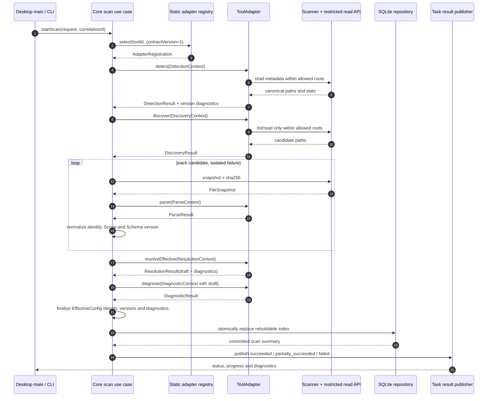

# AI Config Hub 工具适配器系统

> **目的：** 定义 Claude Code、Cursor、Codex 与 OpenCode 适配器的职责边界、静态注册、版本协商、TypeScript 契约和一致性测试要求。
> **目标读者：** 适配器作者、核心与扫描模块工程师、部署工程师、测试工程师及安全评审者。
> **状态：** MVP 技术基线。
> **相关文档：** [领域模型](./domain-model.md) · [架构总览](./overview.md) · [ADR-0001：模块化单体](../adr/0001-modular-monolith.md) · [完整技术方案设计](../superpowers/specs/2026-06-21-technical-solution-design.md)

## 设计原则

适配器是工具差异的唯一拥有者。核心层只理解统一 `Resource`、`Scope`、`Asset`、`EffectiveConfig`、`Diagnostic`、`ConversionResult` 与部署契约，不根据路径名或工具品牌编写条件分支。

MVP 适配器随产品编译，在应用组合根静态注册。注册表不会搜索用户目录、安装 npm 包、动态 `import()` 任意路径或执行配置中的脚本。新增适配器属于代码变更，必须经过构建、契约测试与发布流程。

## 职责

每个 `ToolAdapter` 负责：

- 检测对应工具的安装/配置根、可识别版本和检测证据，但不以检测为理由启动工具。
- 在调用方授权的根目录内发现 Rules、Agents、Skills、MCP 候选文件，并为嵌套作用域提供层级证据。
- 解析配置文本、工具 Schema、frontmatter 或结构化字段，返回规范化资源、工具扩展和可定位诊断。
- 实现工具自身的继承、优先级、合并、覆盖和忽略规则，返回 `AdapterEffectiveConfigDraft`；核心层补齐身份、版本、诊断与解析时间后形成 `EffectiveConfig`。
- 诊断工具特有的未知字段、无效引用、版本不兼容和能力限制。
- 将统一资产转换为目标工具可表达的输出，准确标记 `full`、`partial` 或 `unsupported`。
- 为目标工具生成确定性的候选文件和验证策略；由部署器据此组装写入计划。
- 在部署器完成写入后以只读方式验证目标工具是否能识别预期配置。
- 声明支持/测试过的工具版本、资源类型、作用域、转换矩阵、统一 Schema 与适配器版本。

## 非职责

适配器不负责：

- UI、CLI 格式化、IPC 路由、用户确认或权限提示。
- SQLite 事务、仓储生命周期、数据库迁移或索引替换。
- 直接备份、写文件、原子替换、目标锁、操作日志或回滚；这些属于 `packages/deployer`。
- 获取或保存 Git 凭据、执行 Git 网络操作；这些属于 `packages/git` 及系统凭据机制。
- 任意路径访问、shell 执行、启动 MCP Server、运行 Hook/Skill/Agent 或求值配置表达式。
- 隐瞒字段损失、将未知语义声称为 `full`，或用工具专属字段扩张通用资源联合。
- 将数据库缓存当作源配置，或在扫描期间修改/修复用户文件。

## TypeScript 契约

以下契约是 `packages/adapters` 公共入口的语义基线。实现可按文件拆分，但公开名称、判别字段和只读边界必须保持一致。`AdapterReadApi` 由扫描器/部署验证器注入并限制在已授权根目录，适配器不能直接获得 Node.js 的通用 `fs` 或 `child_process` 能力。

```ts
export type ToolId =
  | "claude-code"
  | "cursor"
  | "codex"
  | "opencode";

export type AdapterId = string;
export type AssetId = string;
export type ScopeId = string;
export type EffectiveConfigId = string;
export type ConversionResultId = string;
export type DeploymentPlanId = string;
export type DeploymentRecordId = string;
export type AbsolutePath = string;
export type ContentHash = `sha256:${string}`;
export type SemVer = string;
export type SemVerRange = string;
export type JsonPointer = string;

export interface CancellationSignal {
  readonly aborted: boolean;
  throwIfAborted(): void;
}

export interface AdapterLogger {
  debug(event: string, fields?: Readonly<Record<string, unknown>>): void;
  warn(event: string, fields?: Readonly<Record<string, unknown>>): void;
}

export interface FileStat {
  readonly kind: "file" | "directory" | "missing";
  readonly size: number;
  readonly modifiedAt: string;
}

export interface AdapterReadApi {
  realpath(path: AbsolutePath): Promise<AbsolutePath>;
  stat(path: AbsolutePath): Promise<FileStat>;
  list(path: AbsolutePath): Promise<readonly AbsolutePath[]>;
  readText(path: AbsolutePath): Promise<string>;
}

export interface SourceLocation {
  readonly path: AbsolutePath;
  readonly line?: number;
  readonly column?: number;
  readonly pointer?: JsonPointer;
}

export interface AdapterDiagnostic {
  readonly code: string;
  readonly severity: "info" | "warning" | "error";
  readonly message: string;
  readonly location?: SourceLocation;
  readonly evidence: Readonly<Record<string, unknown>>;
  readonly suggestedActions: readonly string[];
  readonly blocking: boolean;
}

export type SecretAwareString =
  | {
      readonly kind: "literal";
      readonly value: string;
      readonly deployable: true;
    }
  | {
      readonly kind: "reference";
      readonly expression: string;
      readonly deployable: true;
    }
  | {
      readonly kind: "redacted";
      readonly digest: ContentHash;
      readonly deployable: false;
    };

export interface RuleResourceData {
  readonly name?: string;
  readonly instructions: string;
  readonly globs: readonly string[];
  readonly extensions: Readonly<Record<string, unknown>>;
}

export interface AgentResourceData {
  readonly name: string;
  readonly instructions: string;
  readonly model?: string;
  readonly allowedTools: readonly string[];
  readonly extensions: Readonly<Record<string, unknown>>;
}

export interface SkillResourceData {
  readonly name: string;
  readonly description?: string;
  readonly instructions: string;
  readonly references: readonly string[];
  readonly extensions: Readonly<Record<string, unknown>>;
}

export type McpTransport =
  | {
      readonly kind: "stdio";
      readonly command: string;
      readonly args: readonly SecretAwareString[];
      readonly env: Readonly<Record<string, SecretAwareString>>;
    }
  | {
      readonly kind: "http" | "sse";
      readonly endpoint: {
        readonly baseUrl: SecretAwareString;
        readonly query: Readonly<
          Record<string, readonly SecretAwareString[]>
        >;
        readonly userInfo?: {
          readonly username: SecretAwareString;
          readonly password?: SecretAwareString;
        };
      };
      readonly headers: Readonly<Record<string, SecretAwareString>>;
    };

export type NormalizedResource =
  | { readonly kind: "rule"; readonly data: RuleResourceData }
  | { readonly kind: "agent"; readonly data: AgentResourceData }
  | { readonly kind: "skill"; readonly data: SkillResourceData }
  | {
      readonly kind: "mcp";
      readonly data: {
        readonly name: string;
        readonly transport: McpTransport;
        readonly extensions: Readonly<Record<string, unknown>>;
      };
    };

export type ResourceKind = NormalizedResource["kind"];
export type ScopeKind = "user" | "project" | "directory";

export interface ScopeCandidate {
  readonly kind: ScopeKind;
  readonly canonicalRootPath: AbsolutePath;
  readonly projectRoot?: AbsolutePath;
  readonly parentRoot?: AbsolutePath;
  readonly depth: number;
  readonly precedence: number;
}

export interface ToolInstallation {
  readonly toolId: ToolId;
  readonly installationId: string;
  readonly detectedVersion?: SemVer;
  readonly configRoots: readonly AbsolutePath[];
  readonly evidence: Readonly<Record<string, unknown>>;
}

export interface DiscoveredResource {
  readonly toolId: ToolId;
  readonly sourcePath: AbsolutePath;
  readonly sourceFormat: string;
  readonly resourceKindHint?: ResourceKind;
  readonly locatorHint?: string;
  readonly scope: ScopeCandidate;
}

export interface FileSnapshot {
  readonly canonicalPath: AbsolutePath;
  readonly text: string;
  readonly contentHash: ContentHash;
  readonly modifiedAt: string;
  readonly size: number;
}

export interface ParsedAsset {
  readonly toolId: ToolId;
  readonly canonicalSourcePath: AbsolutePath;
  readonly locator: string;
  readonly scope: ScopeCandidate;
  readonly sourceFormat: string;
  readonly sourceContentHash: ContentHash;
  readonly resource: NormalizedResource;
  readonly references: readonly string[];
  readonly extensions: Readonly<Record<string, unknown>>;
}

export interface Asset {
  readonly assetId: AssetId;
  readonly scopeId: ScopeId;
  readonly normalizedSchemaVersion: SemVer;
  readonly adapterId: AdapterId;
  readonly adapterVersion: SemVer;
  readonly parsed: ParsedAsset;
}

export interface EffectiveConfigStep {
  readonly action: "inherit" | "merge" | "override" | "ignore";
  readonly assetId: AssetId;
  readonly reason: string;
}

export interface AdapterEffectiveConfigDraft {
  readonly canonicalTargetPath: AbsolutePath;
  readonly resourceKinds: readonly ResourceKind[];
  readonly resolvedResources: readonly NormalizedResource[];
  readonly contributingAssetIds: readonly AssetId[];
  readonly ignoredAssetIds: readonly AssetId[];
  readonly steps: readonly EffectiveConfigStep[];
  readonly resolutionInputHash: ContentHash;
}

export interface EffectiveConfig extends AdapterEffectiveConfigDraft {
  readonly effectiveConfigId: EffectiveConfigId;
  readonly toolInstallationId: string;
  readonly adapterVersion: SemVer;
  readonly diagnostics: readonly AdapterDiagnostic[];
  readonly resolvedAt: string;
}

export interface ConvertedOutput {
  readonly relativePath: string;
  readonly mediaType: string;
  readonly text: string;
  readonly contentHash: ContentHash;
}

export interface FieldTransformation {
  readonly sourceField: JsonPointer;
  readonly targetField: JsonPointer;
  readonly reason: string;
}

interface ConversionBase {
  readonly conversionResultId: ConversionResultId;
  readonly sourceAssetId: AssetId;
  readonly sourceContentHash: ContentHash;
  readonly targetToolId: ToolId;
  readonly targetResourceKind: ResourceKind;
  readonly targetSchemaVersion: SemVer;
  readonly adapterId: AdapterId;
  readonly adapterVersion: SemVer;
  readonly diagnostics: readonly AdapterDiagnostic[];
}

export type ConversionResult =
  | (ConversionBase & {
      readonly level: "full";
      readonly outputs: readonly ConvertedOutput[];
    })
  | (ConversionBase & {
      readonly level: "partial";
      readonly outputs: readonly ConvertedOutput[];
      readonly retainedFields: readonly JsonPointer[];
      readonly droppedFields: readonly JsonPointer[];
      readonly transformedFields: readonly FieldTransformation[];
      readonly warnings: readonly string[];
    })
  | (ConversionBase & {
      readonly level: "unsupported";
      readonly reasons: readonly string[];
    });

export type DeployableConversionResult = Extract<
  ConversionResult,
  { readonly level: "full" | "partial" }
>;

export interface ConversionTarget {
  readonly toolId: ToolId;
  readonly resourceKind: ResourceKind;
  readonly targetSchemaVersion: SemVer;
}

export interface DeploymentTarget {
  readonly tool: ToolInstallation;
  readonly scope: ScopeCandidate;
  readonly canonicalRootPath: AbsolutePath;
}

export type DeploymentOperation =
  | {
      readonly kind: "create";
      readonly targetPath: AbsolutePath;
      readonly nextText: string;
      readonly expectedTargetHash: "absent";
    }
  | {
      readonly kind: "replace";
      readonly targetPath: AbsolutePath;
      readonly nextText: string;
      readonly expectedTargetHash: ContentHash;
    }
  | {
      readonly kind: "delete";
      readonly targetPath: AbsolutePath;
      readonly expectedTargetHash: ContentHash;
    };

export interface DeploymentDiff {
  readonly targetPath: AbsolutePath;
  readonly summary: string;
  readonly unifiedText: string;
}

export interface AdapterDeploymentDraft {
  readonly targetToolId: ToolId;
  readonly operations: readonly DeploymentOperation[];
  readonly diffs: readonly DeploymentDiff[];
  readonly verificationStrategy: string;
  readonly adapterId: AdapterId;
  readonly adapterVersion: SemVer;
}

export type DeploymentStatus =
  | "planned"
  | "confirmed"
  | "backed_up"
  | "writing"
  | "verifying"
  | "succeeded"
  | "failed"
  | "rolling_back"
  | "rolled_back";

export interface DeploymentRecord {
  readonly deploymentRecordId: DeploymentRecordId;
  readonly deploymentPlanId: DeploymentPlanId;
  readonly confirmedPlanHash?: ContentHash;
  readonly status: DeploymentStatus;
  readonly operations: readonly DeploymentOperation[];
  readonly backupLocations: Readonly<
    Record<AbsolutePath, AbsolutePath | "previously-absent">
  >;
  readonly resultingHashes: Readonly<Record<AbsolutePath, ContentHash>>;
  readonly adapterId: AdapterId;
  readonly adapterVersion: SemVer;
  readonly createdAt: string;
  readonly confirmedAt?: string;
  readonly startedAt?: string;
  readonly finishedAt?: string;
  readonly diagnostics: readonly AdapterDiagnostic[];
}

export interface DetectionContext {
  readonly platform: "win32" | "darwin" | "linux";
  readonly homeDirectory: AbsolutePath;
  readonly candidateRoots: readonly AbsolutePath[];
  readonly read: AdapterReadApi;
  readonly signal: CancellationSignal;
}

export interface DiscoveryContext {
  readonly tool: ToolInstallation;
  readonly allowedRoots: readonly AbsolutePath[];
  readonly read: AdapterReadApi;
  readonly signal: CancellationSignal;
}

export interface ParseContext {
  readonly tool: ToolInstallation;
  readonly candidate: DiscoveredResource;
  readonly snapshot: FileSnapshot;
  readonly signal: CancellationSignal;
}

export interface ResolutionContext {
  readonly tool: ToolInstallation;
  readonly targetPath: AbsolutePath;
  readonly assets: readonly Asset[];
  readonly signal: CancellationSignal;
}

export interface DiagnosticContext {
  readonly tool: ToolInstallation;
  readonly assets: readonly Asset[];
  readonly effectiveConfigDraft?: AdapterEffectiveConfigDraft;
  readonly signal: CancellationSignal;
}

export interface ConversionContext {
  readonly asset: Asset;
  readonly target: ConversionTarget;
  readonly signal: CancellationSignal;
}

export interface DeploymentPlanningContext {
  readonly conversion: DeployableConversionResult;
  readonly target: DeploymentTarget;
  readonly currentTargetSnapshots: ReadonlyMap<AbsolutePath, FileSnapshot>;
  readonly signal: CancellationSignal;
}

export interface VerificationContext {
  readonly deployment: DeploymentRecord;
  readonly target: DeploymentTarget;
  readonly read: AdapterReadApi;
  readonly signal: CancellationSignal;
}

export interface DetectionResult {
  readonly installations: readonly ToolInstallation[];
  readonly diagnostics: readonly AdapterDiagnostic[];
}

export interface DiscoveryResult {
  readonly candidates: readonly DiscoveredResource[];
  readonly diagnostics: readonly AdapterDiagnostic[];
}

export type ParseResult =
  | {
      readonly status: "parsed";
      readonly assets: readonly ParsedAsset[];
      readonly diagnostics: readonly AdapterDiagnostic[];
    }
  | {
      readonly status: "rejected";
      readonly assets: readonly [];
      readonly diagnostics: readonly AdapterDiagnostic[];
    };

export interface ResolutionResult {
  readonly draft: AdapterEffectiveConfigDraft;
  readonly diagnostics: readonly AdapterDiagnostic[];
}

export interface DiagnosticResult {
  readonly diagnostics: readonly AdapterDiagnostic[];
}

export interface DeploymentPlanningResult {
  readonly draft: AdapterDeploymentDraft;
  readonly diagnostics: readonly AdapterDiagnostic[];
}

export type VerificationResult =
  | {
      readonly status: "passed";
      readonly verifiedHashes: Readonly<Record<AbsolutePath, ContentHash>>;
      readonly diagnostics: readonly AdapterDiagnostic[];
    }
  | {
      readonly status: "failed";
      readonly verifiedHashes: Readonly<Record<AbsolutePath, ContentHash>>;
      readonly diagnostics: readonly AdapterDiagnostic[];
    };

export type ConversionCapability =
  | {
      readonly resourceKind: "rule";
      readonly targets: readonly ToolId[];
    }
  | {
      readonly resourceKind: "agent";
      readonly targets: readonly ToolId[];
    }
  | {
      readonly resourceKind: "skill";
      readonly targets: readonly ToolId[];
    }
  | {
      readonly resourceKind: "mcp";
      readonly targets: readonly ToolId[];
    };

export interface AdapterCapabilities {
  readonly supportedToolVersions: SemVerRange;
  readonly testedToolVersions: readonly SemVer[];
  readonly readableSchemaVersions: readonly SemVerRange[];
  readonly writtenSchemaVersion: SemVer;
  readonly resourceKinds: readonly ResourceKind[];
  readonly scopeKinds: readonly ScopeKind[];
  readonly supportsNestedScopes: boolean;
  readonly conversions: readonly ConversionCapability[];
}

export interface AdapterFactoryContext {
  readonly logger: AdapterLogger;
}

export interface AdapterRegistration {
  readonly contractVersion: 1;
  readonly adapterId: AdapterId;
  readonly adapterVersion: SemVer;
  readonly toolId: ToolId;
  readonly capabilities: AdapterCapabilities;
  readonly create: (context: AdapterFactoryContext) => ToolAdapter;
}

export interface ToolAdapter {
  readonly adapterId: AdapterId;
  readonly adapterVersion: SemVer;
  readonly toolId: ToolId;
  readonly capabilities: AdapterCapabilities;

  detect(context: DetectionContext): Promise<DetectionResult>;
  discover(context: DiscoveryContext): Promise<DiscoveryResult>;
  parse(context: ParseContext): Promise<ParseResult>;
  resolveEffective(context: ResolutionContext): Promise<ResolutionResult>;
  diagnose(context: DiagnosticContext): Promise<DiagnosticResult>;
  convert(context: ConversionContext): Promise<ConversionResult>;
  planDeployment(
    context: DeploymentPlanningContext,
  ): Promise<DeploymentPlanningResult>;
  verify(context: VerificationContext): Promise<VerificationResult>;
}
```

契约约束：

- 所有返回集合顺序必须确定，以规范化路径、资源种类和 `locator` 排序；同一快照和版本产生相同结果。
- `parse` 可从一个文件返回多个 `ParsedAsset`，每项 `locator` 必须唯一稳定；损坏输入返回 `rejected` 和至少一个 `error` 诊断，而非抛出未分类异常。
- `SecretAwareString.literal` 只承载适配器已判定为非敏感的普通文本；环境变量引用等可安全复现值使用 `reference`；任何秘密明文在规范化前改写为 `redacted`。`redacted` 只保留不可逆摘要且 `deployable=false`，不得进入 `ConvertedOutput` 或 `AdapterDeploymentDraft`；无法以引用安全复现时转换必须返回阻断诊断或 `unsupported`。MCP 的参数、endpoint base URL/query/userinfo、headers 和 env 均遵守此规则，索引和日志不得保留其秘密明文。
- `NormalizedResource` 与 `ConversionResult` 都是封闭的判别联合。新增资源或转换等级是契约变更，必须同步 Schema、存储、API 和全部适配器测试。
- `partial` 必须逐项提供 `retainedFields`、`droppedFields`、`transformedFields`、`warnings`；`unsupported` 不能通过 `DeployableConversionResult` 的类型边界进入 `planDeployment`。
- `resolveEffective` 只返回 `AdapterEffectiveConfigDraft` 和适配器诊断。核心层合并诊断后补齐 `effectiveConfigId`、`toolInstallationId`、`adapterVersion`、`resolvedAt`，生成完整且可持久化的 `EffectiveConfig`；适配器不得伪造这些核心元数据。
- `planDeployment` 只返回确定性的 `AdapterDeploymentDraft`，不读写未提供的路径。`packages/deployer`/核心层基于 draft 和转换结果补齐来源/目标哈希、`deploymentPlanId`、`planHash`、`backupPolicy`、`requiredConfirmations`、待确认警告与有效期，持久化不可变 `DeploymentPlan` 及初始为 `planned` 的 `DeploymentRecord`；实际确认、备份、锁、哈希复检、原子写入和回滚也由部署器负责。
- `verify` 只使用受限 `AdapterReadApi`，不得启动目标工具或执行配置。若只能通过执行才能证明某项语义，MVP 应返回未验证诊断而不是运行它。
- 适配器异常由调用层映射为稳定诊断；错误上下文、日志和 `evidence` 必须脱敏。

## 静态 registry

每个目标工具恰好有一个默认 `AdapterRegistration`，由 `packages/adapters` 公共入口显式导出：

```ts
export const adapterRegistrations = [
  claudeCodeRegistration,
  cursorRegistration,
  codexRegistration,
  openCodeRegistration,
] as const satisfies readonly AdapterRegistration[];

function validateAdapterRegistrationKeys(
  registrations: readonly AdapterRegistration[],
): void {
  const toolIds = new Set<ToolId>();
  const adapterIds = new Set<AdapterId>();

  for (const registration of registrations) {
    if (toolIds.has(registration.toolId)) {
      throw new Error(`duplicate toolId: ${registration.toolId}`);
    }
    if (adapterIds.has(registration.adapterId)) {
      throw new Error(`duplicate adapterId: ${registration.adapterId}`);
    }
    if (registration.contractVersion !== 1) {
      throw new Error(`unsupported contractVersion: ${registration.contractVersion}`);
    }
    toolIds.add(registration.toolId);
    adapterIds.add(registration.adapterId);
  }
}

export function createAdapterRegistry(
  registrations: readonly AdapterRegistration[],
): ReadonlyMap<ToolId, AdapterRegistration> {
  // Key preflight only: run before Map construction can hide duplicates.
  validateAdapterRegistrationKeys(registrations);
  return new Map(
    registrations.map((registration) => [
      registration.toolId,
      registration,
    ]),
  );
}

export const adapterRegistry = createAdapterRegistry(adapterRegistrations);
```

示例中的 `validateAdapterRegistrationKeys` **只负责 key 预检**：在构造 `Map` 前拒绝重复 `toolId`/`adapterId` 和不支持的 `contractVersion`，避免重复项被静默覆盖。它不声称完成能力或 SemVer 协商。

应用组合根还必须在接收请求前实例化每个注册并执行完整启动校验：注册元数据与实例的 `toolId`、`adapterId`、`adapterVersion`、`capabilities` 完全一致；`adapterVersion`、`testedToolVersions` 与版本范围均为有效 SemVer；每个 `testedToolVersion` 都满足 `supportedToolVersions`；`resourceKinds`、`scopeKinds` 与转换声明只包含统一联合成员且互相一致；`writtenSchemaVersion` 可被当前核心读取，所有 `readableSchemaVersions` 都能被版本协商器解析。任一校验失败都视为构建/启动错误，不在运行中悄悄覆盖旧注册。

静态 registry 是组合根拥有的只读对象。测试可以显式构造隔离 registry，但产品运行时不支持用户配置替换、磁盘发现或热加载。

## 版本协商

版本协商分为三个互不替代的维度：

1. **adapter contract。** `contractVersion` 是核心与适配器接口的主版本。MVP 只接受 `1`；不匹配时不实例化适配器。
2. **工具版本。** `detect` 返回 `detectedVersion`；registry 使用 `supportedToolVersions` 判断是否支持，并使用 `testedToolVersions` 标注验证覆盖。范围内但未列入测试矩阵的版本可继续扫描，同时返回 `ADAPTER_TOOL_VERSION_UNTESTED` 警告。
3. **统一 Schema 与适配器版本。** `readableSchemaVersions`/`writtenSchemaVersion` 控制领域载荷，`adapterVersion` 追踪解析与转换语义。每个 `Asset`、转换和部署记录都保存实际版本。

当检测到高于 `supportedToolVersions` 上界的未知新版本时，返回稳定诊断：

```text
code: ADAPTER_TOOL_VERSION_NEWER_THAN_SUPPORTED
severity: warning
blocking: true（对转换与部署）
evidence: { detectedVersion, supportedToolVersions, adapterVersion }
suggestedActions: [升级 AI Config Hub, 仅执行只读扫描并人工核对结果]
```

适配器可在“只读兼容模式”继续发现和解析已知结构，但结果必须带该诊断，不能声称新字段已被完整理解。默认阻止该工具版本的转换/部署；只有后续适配器版本扩大支持范围并补齐版本边界夹具后才解除。版本无法解析时使用 `ADAPTER_TOOL_VERSION_UNKNOWN`，同样不以猜测版本进行写入。

## 扫描链路



扫描器拥有文件读取、路径规范化、允许根校验和哈希；适配器拥有工具语义；核心拥有稳定身份、统一 Schema、任务状态与索引提交。此分工保证适配器无法因解析需要而绕过路径边界，也保证单候选失败被隔离。

## 夹具布局

每个工具在 `packages/adapters/test/fixtures/<toolId>/` 下维护脱敏、最小且可审阅的源夹具，在 `packages/adapters/test/golden/<toolId>/` 下维护规范化资产、诊断、转换与生效配置黄金结果。夹具不得来自真实用户目录，也不能包含可用 Token、私有仓库 URL、个人用户名或真实服务地址。

夹具与黄金文件的唯一规范路径固定如下，不得另设 `fixtures/`、相邻 `expected/` 或其他并行目录：

```text
packages/adapters/test/fixtures/
  claude-code/{valid,malformed,nested-scope,unknown-field,sensitive-value,version-boundary}/
  cursor/{valid,malformed,nested-scope,unknown-field,sensitive-value,version-boundary}/
  codex/{valid,malformed,nested-scope,unknown-field,sensitive-value,version-boundary}/
  opencode/{valid,malformed,nested-scope,unknown-field,sensitive-value,version-boundary}/
packages/adapters/test/golden/
  claude-code/
  cursor/
  codex/
  opencode/
```

`valid` 至少各包含一个 `rule`、`agent`、`skill`、`mcp` 样本；若某工具确实不支持某资源，黄金结果必须是明确的 `unsupported` 能力/诊断，而不是缺少测试。多资源文件、目录约定和优先级规则应使用工具真实支持的格式表达。

## 契约测试矩阵

下表中的每一格都是四个适配器必须独立执行的夹具族，而不是共用一个伪通用文件：

| 适配器 | 有效 `valid` | 损坏 `malformed` | 嵌套作用域 `nested-scope` | 未知字段 `unknown-field` | 敏感值 `sensitive-value` | 版本边界 `version-boundary` |
| --- | --- | --- | --- | --- | --- | --- |
| Claude Code | 发现/解析四类资源；黄金规范化与生效结果确定 | 定位行列/字段；单文件 `rejected`，批次部分成功 | 用户、项目、子目录优先级及覆盖步骤正确 | 保留在 `extensions` 或给出明确诊断，不静默提升语义 | MCP args、endpoint、query、userinfo、headers、env 中的秘密在结果、日志、快照中均不出现明文 | 下界、上界、范围内未测试、上界后新版本诊断 |
| Cursor | 发现/解析四类资源；黄金规范化与生效结果确定 | 定位行列/字段；单文件 `rejected`，批次部分成功 | 用户、项目、子目录优先级及覆盖步骤正确 | 保留在 `extensions` 或给出明确诊断，不静默提升语义 | MCP args、endpoint、query、userinfo、headers、env 中的秘密在结果、日志、快照中均不出现明文 | 下界、上界、范围内未测试、上界后新版本诊断 |
| Codex | 发现/解析四类资源；黄金规范化与生效结果确定 | 定位行列/字段；单文件 `rejected`，批次部分成功 | 用户、项目、子目录优先级及覆盖步骤正确 | 保留在 `extensions` 或给出明确诊断，不静默提升语义 | MCP args、endpoint、query、userinfo、headers、env 中的秘密在结果、日志、快照中均不出现明文 | 下界、上界、范围内未测试、上界后新版本诊断 |
| OpenCode | 发现/解析四类资源；黄金规范化与生效结果确定 | 定位行列/字段；单文件 `rejected`，批次部分成功 | 用户、项目、子目录优先级及覆盖步骤正确 | 保留在 `extensions` 或给出明确诊断，不静默提升语义 | MCP args、endpoint、query、userinfo、headers、env 中的秘密在结果、日志、快照中均不出现明文 | 下界、上界、范围内未测试、上界后新版本诊断 |

所有适配器共享以下断言：

| 契约面 | 必须验证的行为 |
| --- | --- |
| 检测 | 仅在授权根读取；不启动工具；相同环境结果顺序稳定；无法识别版本时有诊断 |
| 发现 | 规范化路径、去重、确定排序；符号链接逃逸被拒绝；未知文件不当作资产 |
| 解析 | 原文只读；一文件多资源的 `locator` 唯一；损坏候选不抛出未分类异常；Schema 版本可追溯 |
| 生效配置 | 输入顺序扰动不改变结果；贡献、忽略资产和每个覆盖步骤可解释 |
| 诊断 | `code` 稳定，位置/证据/影响可定位；敏感值脱敏；阻断标记符合写入风险 |
| 转换 | 四类资源的目标矩阵均有 `full`/`partial`/`unsupported` 黄金结果；`partial` 四类披露字段完整；`unsupported` 无输出 |
| 部署草案 | `AdapterDeploymentDraft` 输出路径在目标根内、操作顺序确定且不含 `redacted` 值；核心/部署器集成测试另行验证不可变 `DeploymentPlan` 的 `planHash`、确认与输入哈希失效语义 |
| 验证 | 只读、不执行目标工具或配置；预期缺失/内容不符返回 `failed` 及可定位诊断 |
| 注册与版本 | 重复注册、契约主版本不符、Schema 不可读在启动时失败；未知新工具版本按约定阻断写入 |

契约测试应在 Windows、macOS 与 Linux 路径语义下运行；涉及原生依赖或打包运行时的适配器还必须纳入 glibc 2.28 基线 CI。黄金文件更新必须与适配器版本变更一同评审，禁止仅为“让测试通过”批量接受未知差异。

## Source Graph Adapter Contract Update

Adapters now parse every asset with a source graph and native identity. `ParseContext.read` exposes text reads plus byte snapshots so Skill package parsing can enumerate `SKILL.md`, support files, metadata files such as `agents/openai.yaml`, media types, and per-file hashes without giving adapters unrestricted filesystem access.

Built-in Skill parsing enforces package limits before normalization: package members are bounded by count and total bytes, binary files are tracked in `sourceFiles`, and package hashes include every member. Tool-specific Skill identity rules are preserved through `nativeIdentity`: Claude Code keeps invocation-oriented directory names, Codex keeps directory identity while allowing duplicate display names, and Cursor/OpenCode validate lower-hyphen names that match the directory.

Schema-aware diagnostics are part of adapter output. Missing required Skill fields, invalid target-specific names, unsupported native fields, missing Codex agent descriptions, Cursor rule activation metadata that cannot be expressed elsewhere, and unsupported MCP native fields now produce stable diagnostics or partial-conversion warnings rather than silent loss.

Conversion planning distinguishes generated outputs from source outputs. The preview service resolves adapter outputs into `resolvedOutputs`, validates generated text hashes from text, validates `copy` and `symlink` source hashes from current source bytes, and gives target adapters the target adapter `writtenSchemaVersion`. Phase 1 built-in Skill migration emits generated `SKILL.md` plus `copy` outputs for text support files; binary support files remain hashed in the package graph and make conversion partial.

Incremental scan matching is source-graph aware. A changed support or metadata path maps back to the owning primary candidate, cached assets are excluded when any `asset.sourceFiles[].path` changes, and diagnostics attached to support files roll up to the owning Skill asset.
