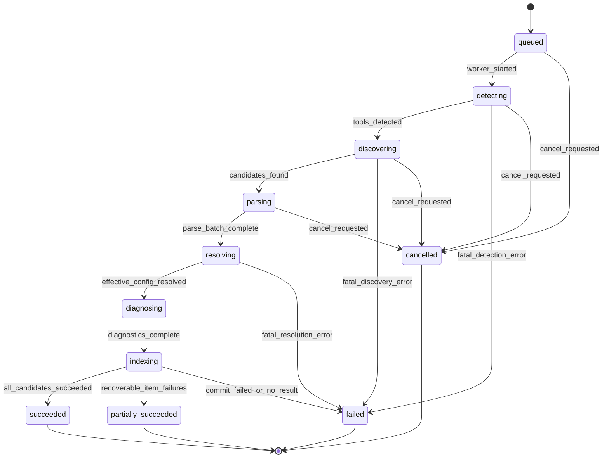
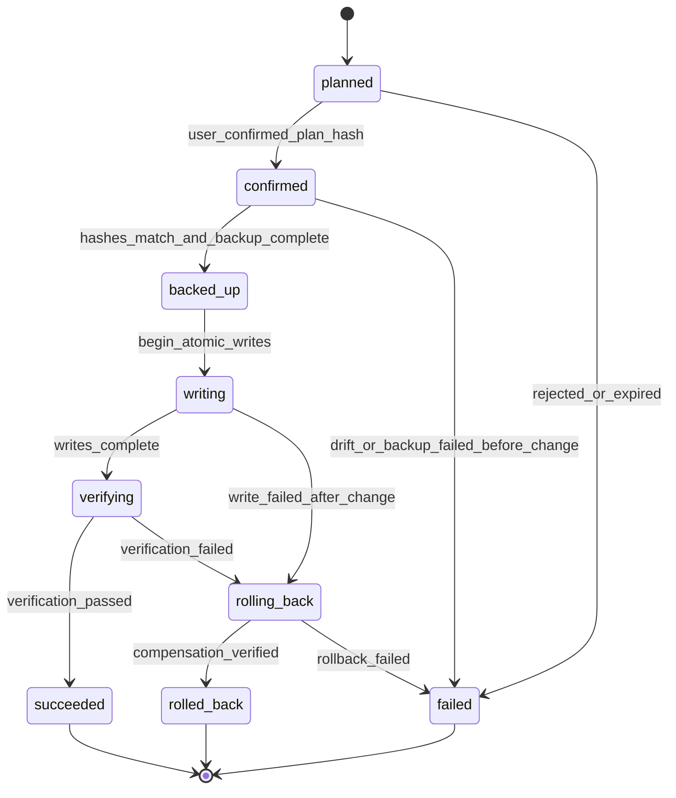

# AI Config Hub 领域模型

> **目的：** 定义 AI Config Hub MVP 的统一语言、实体身份、核心不变量、转换语义与任务生命周期，避免工具差异污染通用业务模型。
> **目标读者：** 核心领域工程师、适配器作者、存储与 API 工程师、测试工程师及技术评审者。
> **状态：** MVP 技术基线。
> **相关文档：** [架构总览](./overview.md) · [适配器系统](./adapter-system.md) · [完整技术方案设计](../superpowers/specs/2026-06-21-technical-solution-design.md)

## 建模约定

- 配置文件是事实来源；领域对象是对文件及其生效语义的可重建解释，不用规范化内容覆盖原文。
- 所有 `*Id` 均为不可变、非空的稳定标识；路径、名称和哈希不是数据库自增 ID 的别名。
- 时间使用 UTC 的 RFC 3339 字符串；路径在比较、加锁、哈希身份和唯一约束前必须规范化。
- 领域层只使用统一资源类型 `rule`、`agent`、`skill`、`mcp`。工具专属字段放入带命名空间的扩展区，不提升为通用语义。
- 领域结果允许附带零到多个 `Diagnostic`。可恢复错误不得伪装成全局失败，阻断写入的错误不得降级为普通警告。

## Tool

**责任。** `Tool` 表示一个受支持 AI Coding 工具的逻辑种类及一次本机检测结果，为适配器选择、能力判断和版本协商提供上下文。

**身份。** `ToolId` 是产品定义的稳定枚举：`claude-code`、`cursor`、`codex`、`opencode`。同一工具的多个安装实例使用独立 `ToolInstallationId`，不能靠显示名称区分。

**关键属性。** `toolId`、`installationId`、`displayName`、`detectedVersion`、`executablePath`（可选）、`configRoots`、`adapterId`、`adapterVersion`、`capabilities`、`detectedAt`。

**不变量。** 一个 `ToolInstallationId` 只属于一个 `ToolId`；未知版本必须产生版本诊断；检测到可执行程序不代表允许执行它；工具能力只能来自已注册适配器声明。

**关系。** `Tool` 由一个 `ToolAdapter` 解释，拥有多个 `Scope` 和 `Asset`，作为 `EffectiveConfig`、`ConversionResult` 与部署目标的维度。

## Resource

**责任。** `Resource` 表示工具配置中的统一语义单元。MVP 仅支持 `Rule`、`Agent`、`Skill`、`MCP`，代码判别值分别为 `rule`、`agent`、`skill`、`mcp`。

**身份。** `Resource` 不是独立持久实体；它由所属 `AssetId` 和判别字段 `kind` 定位。一个源文件含多个资源时，适配器还必须提供文件内稳定 `locator`。

**关键属性。** 所有变体都有 `kind`、规范化数据和 `extensions`。`Rule` 包含指令与匹配范围；`Agent` 包含名称、指令、模型/工具约束；`Skill` 包含名称、说明、步骤与引用；`MCP` 包含服务名、传输方式及脱敏后的启动或连接描述。

**不变量。** `kind` 必须是封闭判别联合的一员；通用字段遵守当前统一 Schema；敏感值不得以明文进入索引、诊断或日志；未知工具字段保留在带工具命名空间的 `extensions` 中，不假装具备跨工具语义。

**关系。** `Resource` 是 `Asset` 的规范化载荷；资源种类决定适配器能力、诊断规则、转换结果与部署格式。

## Scope

**责任。** `Scope` 描述配置生效范围及层级，用于解释用户级、项目级和子目录级配置如何参与继承、合并与覆盖。

**身份。** `ScopeId` 由 `toolId + scopeKind + canonicalRootPath + projectId?` 的稳定规范化键派生。`scopeKind` 为 `user`、`project` 或 `directory`。

**关键属性。** `scopeId`、`toolId`、`scopeKind`、`canonicalRootPath`、`projectId`（可选）、`parentScopeId`（可选）、`depth`、适配器提供的 `precedence`、`discoveryEvidence`。

**不变量。** 路径必须是绝对、规范化并经过符号链接和允许根校验的路径；父 Scope 与子 Scope 属于同一工具和项目链；`depth` 与父子关系一致；优先级必须可由适配器规则和路径证据重算。

**关系。** `Scope` 包含多个 `Asset`，形成用于计算 `EffectiveConfig` 的有向无环层级；`Diagnostic` 可指向错误或冲突发生的 Scope。

## Asset

**责任。** `Asset` 是平台可发现、诊断、转换和部署的统一配置资产；它连接源文件快照、规范化资源与作用域语义。

**身份。** `AssetId` 使用基于命名空间的稳定派生标识，例如 UUIDv5：

```text
AssetId = UUIDv5(assetNamespace, toolId + resource.kind + canonicalSourcePath + locator)
```

`locator` 由适配器为文件内逻辑资源提供，优先采用语义键而非数组下标。这样内容修改、重新扫描和 SQLite 重建不会改变 `AssetId`；源路径或逻辑定位发生变化时视为新资产，历史层可另行记录移动关系。

**关键属性。** `assetId`、`toolId`、`resource`、`scopeId`、`canonicalSourcePath`、`locator`、`sourceFormat`、`contentHash`、`normalizedSchemaVersion`、`adapterId`、`adapterVersion`、`discoveredAt`、`references`、`diagnosticSummary`。

**不变量。** 原始文件不被规范化结果覆盖；同一扫描快照内稳定身份唯一；`contentHash` 与本次读取的确切字节对应；适配器版本和 Schema 版本必须随规范化结果保存；工具专属扩展不得破坏通用 Schema。

**关系。** `Asset` 属于一个 `Tool` 和一个 `Scope`，承载一个 `Resource`，参与零或多个 `EffectiveConfig`，可产生多个 `Diagnostic`、`ConversionResult` 和部署操作。

## EffectiveConfig

**责任。** `EffectiveConfig` 解释在指定工具、项目和目标目录下最终生效的配置，而不只是返回合并后的文本。

**身份。** `EffectiveConfigId` 由 `toolInstallationId + projectId? + canonicalTargetPath + resolutionInputHash + adapterVersion` 派生；它标识一次可复现的解析结果，而非长期可编辑实体。

**关键属性。** `effectiveConfigId`、`toolInstallationId`、`canonicalTargetPath`、`resourceKinds`、`contributingAssetIds`、`ignoredAssetIds`、`steps`（继承/合并/覆盖/忽略及原因）、`resolvedResources`、`resolutionInputHash`、`adapterVersion`、`diagnostics`、`resolvedAt`。

**不变量。** 每个结果必须能追溯到参与资产和有序推导步骤；被忽略资产必须说明原因；同一输入快照和适配器版本产生确定性结果；严重解析错误不得被静默吞掉。

**关系。** `EffectiveConfig` 由多个 `Asset` 按 `Scope` 和工具优先级规则计算，可引用 `Diagnostic`，并可作为迁移前确认现状的输入。

## Diagnostic

**责任。** `Diagnostic` 表示可解释、可定位且可稳定处理的发现、解析、兼容、权限、冲突、部署、验证、Git 或内部问题。

**身份。** `DiagnosticId` 由稳定 `code + subjectId + normalizedLocation + evidenceFingerprint` 派生，使相同问题在重复扫描间可去重；问题证据变化时生成新实例。

**关键属性。** `diagnosticId`、稳定 `code`、`severity`（`info`、`warning`、`error`）、`category`、`message`、`subject`、`location`（路径、行列或 JSON Pointer）、`impact`、`evidence`、`suggestedActions`、`blocking`、`createdAt`。

**不变量。** `code` 的语义在同一主版本内稳定；错误必须尽可能给出来源和范围；`blocking=true` 的诊断阻止对应写入；证据和建议不得包含敏感值明文；通用“解析失败”不能替代已有的行列或字段定位。

**关系。** `Diagnostic` 可以附着于 `Tool`、`Scope`、`Asset`、`EffectiveConfig`、`ConversionResult`、扫描任务或 `DeploymentRecord`。

## ConversionResult

**责任。** `ConversionResult` 描述一个源 `Asset` 到目标工具/资源格式的兼容判断、候选输出和信息损失，是部署预览的上游结果。

**身份。** `ConversionResultId` 由 `sourceAssetId + sourceContentHash + targetToolId + targetResourceKind + adapterVersion + targetSchemaVersion` 派生。

**关键属性。** 所有变体都有 `conversionResultId`、`sourceAssetId`、`sourceContentHash`、`targetToolId`、`targetResourceKind`、`targetSchemaVersion`、`adapterVersion`、`level`、`diagnostics`。三个固定等级为：

- `full`：目标完整表达源资产语义；包含可部署 `outputs`，没有已知语义丢失。
- `partial`：目标只能表达部分语义；必须同时包含可部署 `outputs`、`retainedFields`、`droppedFields`、`transformedFields` 和用户可见 `warnings`。`transformedFields` 逐项说明源字段、目标字段和变换原因。
- `unsupported`：目标无法安全或有意义地表达该资源；包含结构化 `reasons`，且不包含可部署输出。

**不变量。** 等级只能是 `full`、`partial`、`unsupported`；`partial` 的保留/丢弃/变换字段和警告列表均不可省略（没有对应项时使用空数组）；`unsupported` 绝不能被传入可执行部署；转换不修改源 `Asset`。

**关系。** `ConversionResult` 由源 `Asset` 和目标适配器产生；`full` 或经用户知情接受的 `partial` 可进入 `DeploymentPlan`。

## DeploymentPlan

**责任。** `DeploymentPlan` 是部署前不可变的预览与并发控制凭据，列出目标、差异、前置条件、备份策略和有序操作，但本身不写文件。

**身份。** `DeploymentPlanId` 是创建时生成的不可变标识。计划内容另有 `planHash`，由规范化操作、预期哈希和适配器版本计算，用于确认后防篡改。

**关键属性。** `deploymentPlanId`、来源 `conversionResultIds`、`operations`、结构化与文本 `diffs`、`expectedSourceHashes`、`expectedTargetHashes`（不存在目标使用明确哨兵值）、`backupPolicy`、`verificationStrategy`、`requiredConfirmations`、`planHash`、`adapterVersion`、`createdAt`、`expiresAt`（可选）。

**不变量。** 计划不含 `unsupported` 转换；目标路径唯一且均通过允许根校验；操作顺序确定；计划一经生成即不可变且自身没有生命周期状态；执行前任一来源或目标哈希漂移都会使计划失效并要求重新预览；`partial` 必须保留用户需要看到并确认的警告证据。

**关系。** `DeploymentPlan` 消费一个或多个可部署 `ConversionResult`。计划生成并持久化时，系统在同一持久化边界创建对应 `DeploymentRecord`，记录初始状态 `planned`；后续确认与执行只推进记录状态，不修改计划。

## DeploymentRecord

**责任。** `DeploymentRecord` 是从不可变计划产生到部署终态的审计与恢复记录，持续记录确认、每步结果、备份、验证和回滚证据。

**身份。** `DeploymentRecordId` 在不可变 `DeploymentPlan` 生成并持久化时同步生成，永不复用；它引用且不替代 `DeploymentPlanId`，二者是一对一关系。

**关键属性。** `deploymentRecordId`、`deploymentPlanId`、`status`（初始为 `planned`）、`createdAt`、`confirmedAt`（可选）、`confirmedPlanHash`（确认后设置）、`startedAt`（可选）、`finishedAt`（可选）、`operations`、`backupLocations`、`writeResults`、`verificationResult`、`rollbackResults`、`correlationId`、`diagnostics`、执行时适配器与 Schema 版本。

**不变量。** 创建记录时必须同时持久化计划且 `status=planned`；状态只能按 `planned → confirmed → backed_up → writing → verifying → succeeded` 或状态机定义的失败/回滚分支迁移；`confirmedPlanHash` 必须与所引用不可变计划的 `planHash` 一致；每个已写目标必须有对应备份或明确的“原先不存在”记录；`succeeded` 必须具备通过的验证证据；发生写入后失败必须尝试回滚；审计记录与日志必须脱敏；记录不因 SQLite 可重建而授权覆盖源文件。

**关系。** `DeploymentRecord` 引用一个不可变 `DeploymentPlan`、多个目标操作与备份，可产生 `Diagnostic`，并作为后续显式回滚和历史查询的依据。

## 扫描状态机

扫描任务以 `ScanRunId` 标识。取消只停止尚未开始的工作；已提交的索引批次保持一致。单个候选失败通常进入 `partially_succeeded`，只有任务级前置条件或所有候选失败才进入 `failed`。



状态含义：`queued` 等待执行；`detecting` 检测工具与版本；`discovering` 枚举候选；`parsing` 读取、哈希并解析；`resolving` 计算作用域及生效配置；`diagnosing` 汇总问题；`indexing` 原子提交本次索引；其余为终态。

## 部署状态机

不可变 `DeploymentPlan` 持久化时同步创建 `DeploymentRecord(status=planned)`；用户确认只把记录推进到 `confirmed`，不改变计划。部署进入 `writing` 后不接受普通取消请求，必须走完验证或补偿。`failed` 既可表示写入前失败，也可表示回滚自身未完成；调用方必须结合操作和回滚结果判断是否需要人工恢复。



必须存在的部署状态为 `planned`、`confirmed`、`backed_up`、`writing`、`verifying`、`succeeded`、`failed`、`rolling_back`、`rolled_back`。状态更新和对应操作日志应以能够恢复的顺序持久化；文件系统原子替换与 SQLite 事务之间使用补偿日志，而非假设存在跨资源事务。

## 身份、路径、哈希与版本

### 稳定身份

稳定身份用于跨重复扫描、内容编辑和 SQLite 重建关联同一逻辑对象。`AssetId` 的输入是工具、资源种类、规范化来源路径和文件内 `locator`；`ScopeId` 使用规范化根路径与层级语义。显示名称、数据库行号、发现顺序均不得参与永久身份。

适配器必须保证 `locator` 在同一文件内确定且唯一。若源格式没有语义键，只能使用不稳定位置时，应生成 `ASSET_LOCATOR_UNSTABLE` 诊断，并让调用方理解重排可能产生新 `AssetId`。

### 规范化路径

路径处理顺序为：解析用户变量和相对基准 → 转为绝对路径 → 词法规范化 `.`/`..` → 解析实际存在祖先的符号链接 → 采用平台感知的分隔符与大小写比较键 → 验证位于允许根内。展示路径可保留用户友好形式，身份、互斥锁、唯一约束和安全判断只使用 `canonicalPath`/`comparisonKey`。

Windows 的大小写不敏感比较与驱动器规范化不能改变原始展示；macOS 文件系统的实际大小写行为由运行时探测；Linux 按大小写敏感处理。不存在的部署目标通过规范化其最近已存在父目录后再拼接受控文件名，防止符号链接逃逸。

### 内容哈希

`contentHash` 对读取到的原始字节计算，算法和编码写入前缀，例如 `sha256:<hex>`。它用于：

- 跳过未变化文件的重复解析；
- 标识 `EffectiveConfig` 的输入快照；
- 预览到执行之间的乐观并发/漂移检查；
- 部署后验证目标是否为预期字节。

哈希**不作为永久 `AssetId`**：任何正常内容编辑都会改变哈希，若以哈希作 ID，会把“同一资产的新版本”误判成新资产；相同内容的不同路径又会错误合并。因此身份描述“它是谁”，哈希描述“这次读到了什么”。

### Schema 版本

`normalizedSchemaVersion` 标识统一资源 Schema，遵循 SemVer。规范化载荷写入 SQLite、API 或黄金文件时必须携带该版本。主版本变化表示不兼容结构；读取旧主版本必须经过显式迁移或重新扫描，不能静默强制转换。由于文件是事实来源，无法迁移的派生索引可丢弃并重建。

数据库 Schema 版本与统一资源 Schema 版本是两个独立维度：前者管理表结构，后者管理领域载荷，不得共用一个版本号。

### adapter 版本

每个规范化结果、生效配置、转换结果、部署计划和部署记录都保存 `adapterId` 与 `adapterVersion`。适配器使用 SemVer；改变解析、优先级、转换或验证语义至少提升相应版本，并更新夹具黄金结果。历史记录展示时使用当时版本解释，重新扫描可用新版本产生新的派生结果，但不得改写既有部署审计事实。
