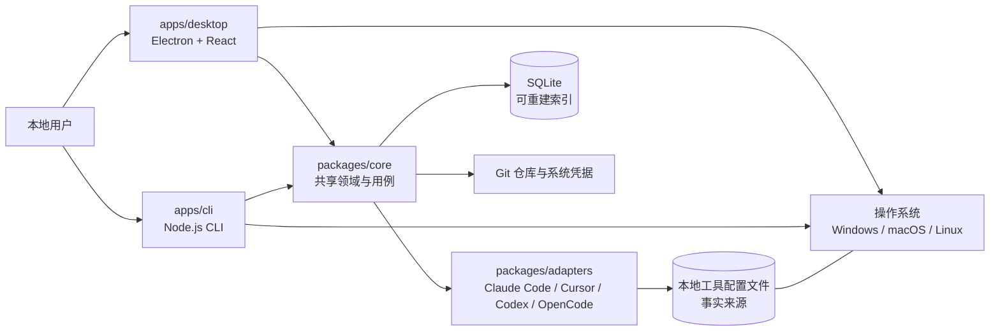
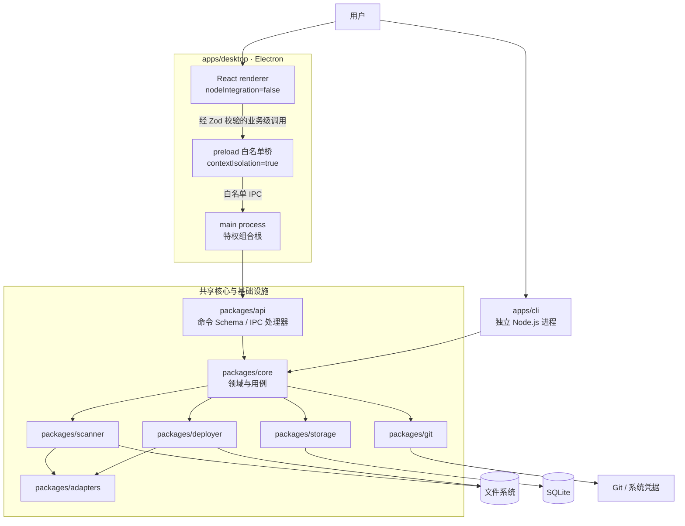

# AI Config Hub 架构总览

> **目的：** 定义 AI Config Hub MVP 的系统边界、运行时拓扑、包依赖方向和关键架构约束，作为实现与评审的共同基线。
> **目标读者：** 应用工程师、CLI 工程师、适配器作者、测试工程师、安全评审者与发布工程师。
> **状态：** MVP 技术基线。
> **相关文档：** [领域模型](./domain-model.md) · [适配器系统](./adapter-system.md) · [ADR-0001：模块化单体](../adr/0001-modular-monolith.md) · [ADR-0002：Electron 安全边界](../adr/0002-electron-security-boundary.md) · [ADR-0003：文件为事实来源](../adr/0003-files-as-source-of-truth.md) · [完整技术方案设计](../superpowers/specs/2026-06-21-technical-solution-design.md)

## 架构目标

AI Config Hub 是统一管理 Claude Code、Cursor、Codex 与 OpenCode 配置资产的本地平台。MVP 架构必须同时满足以下目标：

1. **一套业务语义，两个入口。** Electron + React 桌面端与独立 Node.js CLI 共享 `packages/core` 中的领域模型和核心用例；CLI 不启动或依赖 Electron。
2. **本地文件保持权威。** 工具配置文件是事实来源；SQLite 只保存可重建的索引、规范化结果、诊断和操作记录，数据库丢失不得导致源配置丢失。
3. **默认只读且不执行配置。** 首次扫描及普通扫描只读取文本和元数据，不执行 Skill、Hook、MCP 命令、配置中引用的程序或任何第三方脚本。
4. **所有写入受控。** 写入必须经过转换、差异预览、用户确认、漂移检查、备份、原子写入、重新扫描验证；失败时按操作日志回滚。
5. **工具差异被隔离。** 工具目录、格式、优先级和兼容规则只存在于编译时注册的适配器内，不泄漏到 UI 或通用领域规则。
6. **最小特权。** Electron 主进程持有文件系统、SQLite、Git 和必要的子进程权限；renderer 不可直连文件系统，也不能获得通用 shell 能力。
7. **跨平台可交付。** 全仓使用 TypeScript，目标为 Windows、macOS、Linux；Linux 桌面端和 CLI 的构建、原生依赖与冒烟测试以 **glibc 2.28** 为兼容基线。
8. **故障可解释、可局部恢复。** 单文件损坏不阻断整次扫描；诊断应定位来源、范围与证据；部署记录必须能说明写入、验证及回滚结果。

## 系统上下文

桌面端和 CLI 只是不同的交互与呈现层。它们传入相同的用例请求，获得相同的领域结果和稳定错误码。SQLite 可通过重新扫描文件重建；它不升级为第二事实来源。Git 用于个人或团队资产版本能力，但不会改变本机工具文件的权威地位。

系统上下文明确排除云端托管、账号系统、实时协作、在线市场、MCP 进程管理和第三方脚本执行。网络访问不是完成扫描、诊断和本地部署的前提。

## 模块化单体

仓库采用 pnpm workspace 管理的模块化 Monorepo，并作为一个本地产品发布。模块化单体使 MVP 能共享类型、测试、构建与发布流水线，同时以包公开入口保持清晰边界。

- `apps/*` 是组合根和交互入口，不承载可复用业务规则。
- `packages/core` 定义领域模型、用例以及文件、存储、Git 等端口。
- 基础设施包实现端口；适配器实现工具差异；应用在启动时显式装配它们。
- 所有适配器随产品编译并静态注册。MVP 不扫描任意目录加载插件，也不执行外部适配器代码。
- SQLite、文件系统与 Git 仍在同一进程边界内，但通过接口和事务/补偿边界隔离。

该形态不是“所有代码互相可见”的单包应用。包依赖、公开导出与测试契约是模块边界；未来只有在远程访问、独立伸缩或第三方插件权限模型成熟后，才评估拆分进程或服务。

## 运行时拓扑

图中刻意不存在 renderer 到文件系统、SQLite、Git 或 `packages/core` 的直接边。renderer 运行在隔离上下文中，必须配置 `contextIsolation=true`、`nodeIntegration=false`，只通过 preload 暴露的最小、类型化白名单发送业务级 IPC。主进程负责输入校验、身份关联、调用核心用例和权限控制，不暴露 `readFile(path)`、`exec(command)` 等通用高权限接口。

CLI 在独立 Node.js 进程中直接装配并调用同一组核心用例，不经过 IPC。CLI 和桌面主进程可以使用不同的输出与进度适配器，但解析、层级计算、诊断、转换、部署计划和验证语义必须一致。

## 包依赖规则

依赖箭头统一表示“左侧可以依赖右侧的公开入口”。允许的主要方向如下：

| 模块 | 责任 | 允许的直接依赖方向 |
| --- | --- | --- |
| `apps/desktop` | Electron main/preload、React renderer、桌面组合根 | main → `packages/api`、`packages/core` 及装配所需基础设施；preload/renderer → browser-safe 的 `packages/api`、`packages/shared` |
| `apps/cli` | CLI 参数、终端/JSON 输出、CLI 组合根 | → `packages/core`、`packages/api` 的共享 Schema，以及装配所需基础设施 |
| `packages/core` | 领域模型、端口、用例编排、业务不变量 | → `packages/shared`；不得依赖 Electron、React、SQLite 驱动或具体工具实现 |
| `packages/adapters` | 工具检测、发现、解析、优先级、诊断、转换和验证规则 | → `packages/core` 的公开契约、`packages/shared` |
| `packages/scanner` | 安全读取、哈希、扫描编排、增量变化检测 | → `packages/core` 端口、`packages/adapters` 公共注册表、`packages/shared` |
| `packages/deployer` | 差异、漂移检查、备份、原子写入、验证和回滚 | → `packages/core` 端口、`packages/adapters` 公共契约、`packages/shared` |
| `packages/storage` | SQLite/Drizzle 仓储、迁移、事务 | → `packages/core` 的仓储端口、`packages/shared` |
| `packages/git` | Git 资产仓库、版本历史与凭据桥接 | → `packages/core` 的 Git 端口、`packages/shared` |
| `packages/api` | Zod 命令/事件 Schema、IPC handler 与安全客户端 | → `packages/core` 用例接口、`packages/shared`；browser-safe 导出不得引用 Node.js 模块 |
| `packages/shared` | 基础类型、错误码、日志接口、无业务语义工具 | 不依赖任何 `apps/*` 或其他 `packages/*` |

附加约束：

- 包之间只能从对方 `exports` 声明的公开入口导入，禁止 `packages/x/src/internal/*` 形式的深层导入。
- 不允许循环依赖。`core` 通过依赖倒置声明端口，具体基础设施在应用组合根注入。
- renderer 使用的 API 子入口必须可在浏览器环境构建，不能传递 Node.js `Buffer`、文件句柄或数据库对象。
- `scanner` 读取文件，`deployer` 写入文件；适配器获得受限上下文，不自行扩张路径或进程权限。
- `storage` 失败不能驱使系统以数据库旧值覆盖配置文件；迁移失败时进入可诊断的只读恢复模式。
- 引入任何原生 Node.js 依赖前，必须验证 Electron ABI、三平台预构建产物和 glibc 2.28；可行时优先纯 TypeScript 或 WebAssembly 实现。

## 关键数据流

### 扫描、解析与索引

1. 桌面主进程或 CLI 向共享扫描用例提交根目录、工具筛选和任务关联 ID。
2. 静态适配器注册表执行工具检测和候选资源发现；扫描器只访问允许根目录内的规范化真实路径。
3. 扫描器读取文本快照并计算内容哈希；适配器安全解析、校验并返回规范化资源或可定位诊断，绝不执行配置内容。
4. 核心层生成稳定资产身份，计算 `Scope`、继承/覆盖关系、`EffectiveConfig` 与诊断。
5. 存储层在事务中更新可重建索引。单文件失败作为部分成功保存，不撤销其他成功资产。
6. UI 或 CLI 通过任务状态和查询用例读取结果。首次扫描在此结束，默认不产生任何配置文件写入。

### 转换、预览与部署

1. 核心层选择源 `Asset` 和目标工具，调用适配器得到 `full`、`partial` 或 `unsupported` 的转换结果。
2. 对 `partial` 显式展示保留、丢弃、变换字段和警告；`unsupported` 不得生成可执行写入计划。
3. `deployer` 生成结构化操作与文本差异，并记录源、目标的预览时哈希。
4. 用户明确确认后，执行前再次检查路径和哈希；任何漂移都会使旧计划失效。
5. 系统先备份目标，再以临时文件、刷新和原子替换执行写入，随后重新扫描并由目标适配器验证。
6. 验证成功写入历史；任何已发生写入的失败按相反顺序回滚，并记录回滚验证结果。

### 文件监听与增量更新

`scanner` 对已登记目录的变化事件去抖和合并，以规范化路径触发增量扫描。`deployer` 写入附带任务关联标识，监听器据此抑制重复事件，但部署后的验证扫描始终执行。监听溢出、目录重命名或状态不确定时，退化为全量只读扫描。

## 扩展边界

MVP 的扩展点是编译期代码边界，而不是运行时插件系统：

- 新工具通过实现 `ToolAdapter`、增加静态 `AdapterRegistration`、脱敏夹具和契约测试接入。
- 新资源类型需要同时升级统一资源判别联合、Schema 版本、适配器能力、存储映射、API Schema 与 UI 展示，不能仅在某个适配器中私自增加字符串值。
- 新的存储、Git 或文件实现通过 `packages/core` 端口替换，不改变用例契约。
- 新入口（例如未来本地 Web UI）只能调用业务级 API；若跨主机访问，必须另行设计认证、TLS、来源限制和网络威胁模型。
- 动态第三方插件、任意脚本 Hook、云同步、远程 MCP 管理不属于 MVP。未来引入前必须先定义签名、权限、沙箱、版本协商、撤销和供应链策略。

## 架构验收检查表

- [ ] `apps/desktop` 和 `apps/cli` 对同一夹具调用同一核心用例，并产生等价的领域结果与错误码。
- [ ] Electron renderer 设置 `contextIsolation=true`、`nodeIntegration=false`，且无直接文件系统、SQLite、Git 或 shell 接口。
- [ ] 首次扫描及常规扫描只读，不执行 Skill、Hook、MCP 命令或第三方配置脚本。
- [ ] Claude Code、Cursor、Codex、OpenCode 的 Rules、Agents、Skills、MCP 均有适配器能力声明和契约测试。
- [ ] 配置文件是事实来源；删除 SQLite 后可通过扫描重建当前索引，不会反向覆盖文件。
- [ ] 单文件损坏返回可定位诊断和部分成功，不阻断其他候选文件。
- [ ] `partial` 转换披露字段损失与变换；`unsupported` 不能进入可执行部署。
- [ ] 每次写入均有预览、明确确认、哈希漂移检查、备份、原子写入、验证和可验证回滚记录。
- [ ] 包依赖无环、只走公开入口，`packages/core` 不依赖具体基础设施，`packages/shared` 不反向依赖应用包。
- [ ] 日志、诊断、SQLite 索引和测试夹具不泄露 Token、密钥或敏感环境变量明文。
- [ ] Windows、macOS 与 Linux 产物完成安装/启动冒烟；Linux 桌面端和 CLI 在 glibc 2.28 基线环境通过验证。
- [ ] 静态 registry 拒绝重复 `toolId`、不兼容契约版本和无对应测试声明的适配器注册。
