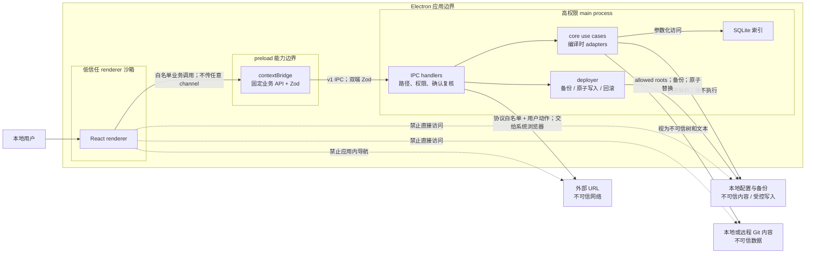

# 安全架构与威胁模型

| 项目 | 内容 |
| --- | --- |
| 目的 | 定义 AI Config Hub 的资产、参与者、信任边界、主要威胁和 MVP 强制安全控制 |
| 目标读者 | Electron 与核心模块开发者、适配器开发者、发布工程师、安全审查人员、测试工程师 |
| 状态 | MVP 技术基线 |
| 相关文档 | [架构总览](./overview.md) · [适配器系统](./adapter-system.md) · [数据存储](./data-storage.md) · [API、IPC 与 CLI](./api-and-ipc.md) · [ADR-0002：Electron 特权能力仅存在于主进程](../adr/0002-electron-security-boundary.md) · [已确认技术方案](../superpowers/specs/2026-06-21-technical-solution-design.md) |

## 1. 安全目标与非目标

MVP 的安全目标是：在本地发现和解释第三方配置时不执行其内容；渲染进程失陷时仍不能直接取得 Node.js、文件、SQLite、Git 或 shell 能力；任何写入都限定到已验证目标，并且经过预览、哈希复核、备份、原子替换、验证和可追溯回滚；秘密不进入普通日志、IPC、索引或不受控备份。

MVP 不是恶意操作系统管理员或已完全控制用户账号的恶意软件的安全边界。产品也不托管云端账号、不运行 MCP Server、不执行 Skill/Hook/Agent/命令、不为 Git 自建凭据库。即使如此，对来自配置文件、Git 仓库、renderer 和外部 URL 的输入一律按不可信数据处理。

## 2. 受保护资产

| 资产 | 机密性 | 完整性/可用性要求 |
| --- | --- | --- |
| 本地配置与目标文件 | 可能包含项目规则、路径和秘密引用 | 不能被未确认覆盖；写入可验证、可回滚 |
| Token、API Key、密码、私钥、Cookie、认证环境变量 | 高 | 不落普通日志/SQLite/IPC；不因扫描、导出或备份扩大暴露 |
| Git 凭据和系统凭据代理 | 高 | 只由现有 OS/Git 机制使用，产品不读取或持久化明文 |
| 备份 | 与源文件同级，可能为高 | 最小权限、完整性哈希、受控保留和恢复 |
| SQLite 索引和部署审计 | 中 | 可重建索引与不可抵赖部署记录边界清楚，不被恶意输入篡改查询语义 |
| 日志和诊断 | 中 | 可定位问题但不泄漏秘密、完整配置或不必要的绝对路径 |
| allowed roots 与安全设置 | 高 | 不能被 renderer 或配置文本任意扩大 |
| 应用包、依赖、更新与适配器注册表 | 高 | 来源、校验和、签名和版本可验证，不加载未批准代码 |

## 3. 参与者与能力

| 参与者 | 合法能力 | 不应获得的能力 |
| --- | --- | --- |
| 本地用户 | 选择扫描根、查看结果、确认预览、部署和回滚 | 通过 UI 无意越过 allowed roots 或执行配置内容 |
| Electron renderer | 展示脱敏数据、调用 preload 白名单业务命令 | Node.js、任意 IPC、文件、shell、SQLite、Git 凭据能力 |
| preload | 校验并转发固定业务命令、订阅固定事件 | 通用 `ipcRenderer`、`fs`、shell 或可拼接 channel 暴露 |
| main process | 持有 OS 权限、实施路径/权限/确认校验、编排核心用例 | 信任 renderer、配置文本或 Git 内容已安全 |
| core 与编译时适配器 | 解析文本、规范化、诊断、生成计划 | 动态执行/导入第三方配置，直接绕过部署器写文件 |
| CLI | 以当前 OS 用户调用同一用例 | 绕过路径、漂移、预览、备份和只读恢复控制 |
| 本地 Git/凭据代理 | 拉取与提交用户明确选择的仓库 | 将凭据返回给 renderer、日志或资产模型 |
| 配置/Git 内容提供者 | 提供待解析文本和仓库树 | 通过文件名、链接、Markdown、Hook 或依赖触发执行/越界读取 |
| 外部网站 | 接收用户明确批准后由系统浏览器打开的 URL | 在 Electron 内导航、使用非白名单协议或带出秘密参数 |

## 4. 信任边界



边界含义：

- renderer 内容、DOM、依赖和用户粘贴文本均可能恶意；`contextIsolation` 不能替代 API 最小化。
- preload 是窄能力转换层，不包含业务状态，也不返回 Electron 原生对象。
- main process 是授权决策点；即使 preload 已验证，main 仍重复校验 Schema、路径、哈希和状态。
- core 把文件、配置字段、Markdown、Git 路径、提交消息和适配器输入全部视为数据。
- 文件系统不是单一可信区：配置内容不可信，而部署目标和备份需要高完整性控制。

## 5. 威胁分析

| 威胁 | 入口 | 影响 | 预防 | 检测 | 恢复 |
| --- | --- | --- | --- | --- | --- |
| 路径遍历 | renderer/CLI 参数、配置引用、Git 路径中的 `..`、绝对路径或编码变体 | 读取或覆盖 allowed roots 外的文件 | 先解码再规范化；使用 canonical path；拒绝绝对/设备/UNC 绕过；目标必须是已登记根的后代；业务 ID 替代任意路径 IPC | 记录脱敏的 `PATH_OUTSIDE_ALLOWED_ROOT`、根 ID 与 correlation ID；路径安全契约测试 | 中止任务，不产生写入；若发生写入异常，隔离目标并从已验证备份恢复 |
| 符号链接逃逸 | 扫描根、配置文件、父目录、临时文件或备份路径被替换为 symlink/junction/reparse point | 越界读取、覆盖任意文件或 TOCTOU | 枚举时解析 `realpath`；写入时使用 no-follow、已打开目录/文件句柄和平台 file identity 复核；在已验证目录句柄下创建临时文件；无法保证时只读降级 | 比较 canonical path、POSIX device/inode 或 Windows volume/file ID；发现改变返回 `SYMLINK_ESCAPE`/`STALE_TARGET` | 停止批次并回滚已完成操作；`DeploymentRecord.status` 记为 `failed`，对路径启用系统 recovery lock/mode 并要求用户检查链接 |
| renderer compromise | XSS、恶意 Markdown/HTML、前端依赖漏洞、DevTools 滥用 | 调用高权限能力、窃取数据、发起部署 | `contextIsolation: true`、`nodeIntegration: false`、兼容时 `sandbox: true`；严格 CSP；最小 preload；固定 IPC channel；写入口重新校验 `confirmedPlanHash`、确认集合、哈希、allowed roots 和 lease/fence；不渲染原始 HTML | CSP 报告、本地安全日志、未知 channel 拒绝计数、E2E 负向测试 | 关闭受影响窗口/应用；检查部署历史和文件哈希；升级后重新扫描 |
| 恶意配置文本 | Markdown、YAML、JSON、Frontmatter、MCP/Skill/Agent 字段中的 HTML、超大/深层对象、控制字符 | XSS、解析器 DoS、日志伪造、意外执行 | 纯文本读取；大小/深度/数量限制；安全解析器；输出转义；React 文本节点展示；不允许 `dangerouslySetInnerHTML`；绝不执行第三方配置 | 解析超限与危险字段诊断；模糊测试；渲染测试；资源使用监控 | 跳过单个文件并产生可定位诊断，其他资产部分成功；用户修复后重扫 |
| 命令注入 | Git 参数、文件名、MCP command、Hook、设置或配置字段进入 shell | 执行任意命令、泄密、破坏文件 | 不执行 Skill/Hook/MCP/第三方命令；需要 Git 时使用参数数组和受控二进制，不用 shell 字符串；禁止通用 shell IPC；参数使用 `--` 分隔 | 记录稳定操作类型而非命令串；注入字符夹具；审计所有 `child_process` 调用点 | 终止子进程，保留审计，检查工作树与凭据代理；从备份/版本库恢复受影响文件 |
| 密钥泄漏 | 配置解析、SQLite、IPC、日志、诊断、崩溃报告、剪贴板和导出 | 第三方服务账户被接管 | 秘密键名不区分大小写检测；值脱敏；日志字段 allowlist；SQLite 不落明文；IPC 不返秘密正文；系统 Git 凭据机制；默认无遥测 | CI 秘密扫描；日志/DB/JSON 黄金测试；高熵值和已知格式检测 | 停止传播并清理日志/导出/备份副本；提示用户轮换密钥；记录不含秘密的事件 |
| 陈旧预览覆盖 | 预览后源或目标被编辑、另一窗口/CLI 并发部署 | 覆盖新修改、生成不一致配置 | 计划绑定源/目标 SHA-256、目标 canonical path、`planHash` 和过期时间；执行请求必须回传匹配的 `confirmedPlanHash` 和确认集合；desktop/CLI 共用 SQLite lease 与单调 fence；每个写操作前复核 fence、哈希和 file identity | `STALE_PREVIEW`/`STALE_TARGET`/`FENCE_REJECTED`；Chokidar 哈希漂移；部署 preflight 对账；记录 lease owner/fence 的脱敏 ID | 不写入并要求重新预览；若写入中发现漂移或失去 fence，停止后续操作并按补偿日志回滚；无法补偿时开启系统 recovery lock/mode |
| 备份暴露 | 权限过宽的备份目录、云同步目录、可预测文件名、保留过久 | 历史秘密和配置外泄 | 备份根不在项目/同步目录；用户专属权限；随机不透明名称；不跟随链接；元数据脱敏；明确保留期；可用时使用 OS 加密能力 | 启动和写入后检查权限/所有者/哈希；清理失败告警；备份访问审计 | 收紧权限，安全删除过期副本；若可能泄密，提示轮换秘密；保留不含内容的审计 |
| 依赖投毒 | npm 包、Electron/Node 原生模块、构建脚本、更新产物 | 构建机或用户环境代码执行、供应链泄密 | 锁定 pnpm 与 lockfile；最小依赖；审查 lifecycle script；CI 冻结安装；来源和许可证审查；发布校验和/签名；原生依赖验证三平台及 glibc 2.28；适配器编译时注册 | 依赖审计、SBOM、lockfile diff 审查、可重复构建对比、产物签名验证 | 撤回发布和密钥、固定安全版本、重建并重新签名；发布安全公告与升级指引 |
| 不可信 Git 内容 | 恶意仓库文件、symlink、submodule、`.gitmodules`、attributes、hooks、超大历史和文件名 | 越界读取、DoS、命令执行、混淆资产来源 | 默认把 Git 仅作为数据来源；不运行 hooks；禁用自动 submodule；不检出越根链接；限制文件/仓库大小；固定参数化 Git 调用；不信任工作树配置 | 扫描 symlink/submodule/特殊文件诊断；超限事件；记录仓库 ID 与 commit，不记录凭据 | 中止仓库操作、隔离工作树、删除临时 clone；回到已知 commit；重新扫描并标记来源不可信 |

## 6. Electron 加固基线

### 6.1 `BrowserWindow` 与进程隔离

每个承载产品 UI 的窗口至少使用：

```ts
const mainWindow = new BrowserWindow({
  webPreferences: {
    contextIsolation: true,
    nodeIntegration: false,
    sandbox: true,
    preload: trustedPreloadPath,
    webSecurity: true,
    allowRunningInsecureContent: false,
  },
});
```

若某个平台/功能与 `sandbox: true` 不兼容，必须有记录原因、受影响版本、替代控制、测试和移除期限的安全例外；不能静默关闭。MVP 禁用 Electron `remote` module，不安装或模拟等价的 renderer 远程对象桥。

### 6.2 导航、窗口和外部协议

- `will-navigate` 默认 `preventDefault()`；产品窗口只加载随应用打包的可信入口，不允许跳转到 HTTP(S)。
- 使用 `setWindowOpenHandler` 拦截全部 `window.open`，默认返回 `{ action: "deny" }`。
- 外部链接仅响应明确用户点击；在 main process 解析 URL，协议白名单默认只有 `https:`，文档确有需要时允许无凭据的 `http:` 开发链接但生产禁用。
- 永久拒绝 `file:`、`javascript:`、`data:`、`vbscript:`、`shell:` 及未知自定义协议；URL 不得携带 Token、配置正文或本地绝对路径。
- 通过 `shell.openExternal` 交给系统浏览器前再次显示/校验规范化 origin；不在 Electron 内嵌远程内容。
- 注册自定义应用协议时使用固定路由和 Schema，不把 URL 片段直接映射为文件路径或命令。

### 6.3 preload 最小暴露

`contextBridge.exposeInMainWorld` 只暴露冻结的、高层业务方法，例如 `scan.start()`、`assets.list()` 和 `subscribeTask()`。禁止暴露：

- `ipcRenderer`、`send`、`invoke` 或可传 channel 名称的方法；
- Electron event 对象、Node.js `Buffer`、文件句柄、原生路径工具或 Promise resolver；
- 通用文件读取/写入、shell、Git、网络、环境变量或进程信息；
- 可以注册任意回调并接收未校验事件的接口。

订阅方法只传递经过 Zod 校验的纯 JSON，返回无参数取消订阅函数。窗口销毁时主进程和 preload 都清理监听器。

### 6.4 CSP 与内容渲染

生产构建使用响应头或不可被页面改写的 CSP，最低基线为：

```text
default-src 'none'; script-src 'self'; style-src 'self'; img-src 'self' data:;
font-src 'self'; connect-src 'none'; object-src 'none'; base-uri 'none';
frame-ancestors 'none'; form-action 'none'; require-trusted-types-for 'script'
```

如 Vite 开发服务器需要 `connect-src` 或 WebSocket，仅在开发模式按固定 origin 放开。生产禁止 `unsafe-eval` 和内联脚本。配置 Markdown 默认按纯文本或经过 allowlist sanitizer 的受限标记渲染；禁止原始 HTML、脚本、iframe、表单、远程图片和自动协议链接。

### 6.5 IPC 处理

main process 仅注册版本化固定 channel，检查调用来源窗口和 frame，拒绝 subframe/未知 WebContents。请求和响应执行双端 Zod 校验，错误 envelope 脱敏。`migration.preview` 只向 renderer 返回不可变 `planId`/`planHash`、差异和 required confirmations，不返回执行凭据。`deployment.execute` 请求必须带 `planId`、`confirmedPlanHash` 和确认集合；main 重新读取持久计划并复核哈希、确认集合、来源/目标哈希、allowed roots、SQLite lease/fence 和写权限。确认集合不是凭据，不写入日志或 SQLite。CLI 在自身交互或 `--yes --plan --plan-hash` 边界完成等价确认。

## 7. 文件系统与路径安全

### 7.1 canonical path 与 allowed roots

所有文件操作遵循同一顺序：

1. 拒绝 NUL、空路径、设备路径和超长异常输入，按平台规则解码/规范化。
2. 转换为绝对路径并用 `realpath` 获取现有路径的 canonical path；新文件则解析最近现有父目录的 canonical path。
3. 对 Windows 处理盘符、UNC、junction、reparse point 和大小写折叠；对 macOS 考虑文件系统大小写与 Unicode 规范化。
4. 使用路径分段关系判断是否位于 allowed root，禁止字符串前缀判断。
5. 通过平台安全文件抽象以 no-follow 方式打开最近现有父目录和目标，保留句柄并记录 identity：POSIX 使用 `device + inode`，Windows 使用 volume serial + file ID；实际备份、临时文件创建和替换前在已打开句柄上复核。

allowed roots 来源只能是内置适配器目录、受控系统目录选择器或管理员/CLI 明确登记。配置文件、Git 内容、renderer 设置和相对引用不能扩大 allowed roots。扫描 allowed root 不自动赋予写权限；部署目标还必须匹配目标适配器声明的配置位置和预览计划。

### 7.2 symlink 策略

- 发现 symlink 时先记录链接本身和解析目标；默认不跟随指向 allowed root 外的 symlink。
- 写入目标、临时文件、备份目录及其父链不允许是越界 symlink/junction。
- 即便链接目标仍在 allowed root 内，也以解析后的 canonical path 作为锁键和哈希键，避免别名绕过互斥。
- 字符串路径的 `realpath`/`lstat` 只用于发现和诊断，不足以关闭检查到使用之间的竞态；写入必须相对已打开且复核 identity 的目录句柄执行。
- 无法提供 no-follow、稳定 file identity 或可靠原子替换语义的文件系统进入只读扫描模式，禁止部署。

### 7.3 权限与原子写入

- 新配置和临时文件继承目标文件的安全权限；没有既有目标时使用用户专属默认权限，不能创建全局可写文件。
- 备份目录和数据库目录始终使用用户私有权限；POSIX 目录固定 `0700`、文件固定 `0600`，Windows 使用仅当前用户和必要 SYSTEM 可访问的等价 ACL。备份不继承、更不复制源文件的宽松权限。
- desktop 与 CLI 在共享 SQLite `deployment_locks` 中按 canonical target key 获取 lease 和单调 fencing token；`BEGIN IMMEDIATE` 用于获取、续租和释放。进程内锁只优化同进程竞争。
- 每个备份、写入、替换和补偿前都验证 owner/lease/fence，并复核打开句柄的 file identity 与内容哈希。锁只能协调 AI Config Hub 进程；外部程序的修改仍靠 identity/哈希漂移检测。
- 写入使用已验证目录句柄下的随机用户私有临时文件，完成写入、`fsync`、解析和哈希后原子替换，并在平台支持时同步父目录。
- 批量部署逐项持久化补偿日志。任何失败按逆序恢复；补偿失败时 `DeploymentRecord.status` 保持 `failed`，系统对目标启用 recovery lock/mode（可显示 `recovery_required`），而不是增加部署状态。

## 8. 秘密、日志与备份

### 8.1 秘密检测与数据最小化

秘密键名检测不区分大小写，并在去除 `_`、`-`、`.` 后匹配；至少识别 `token`、`secret`、`password`、`passwd`、`privateKey`、`apiKey`、`authorization`、`cookie`、`clientSecret` 和 `credential`。同时检测常见密钥格式和高熵值，但高熵检测只触发脱敏/诊断，不把疑似秘密上传验证。

解析器保存键路径、值类型、存在性和不可逆摘要即可。UI 只显示固定掩码；“复制秘密”不属于 MVP。环境变量引用如 `${API_TOKEN}` 可保留变量名，但不能主动解析并读取进程环境中的值。

### 8.2 日志 allowlist

Pino 日志使用事件类型定义的 allowlist，而不是先记录整个对象再 redact。允许字段包括 `timestamp`、`level`、`eventCode`、`correlationId`、`taskId`、业务实体 ID、计数、phase、稳定错误码和缩略路径。禁止字段包括配置正文、任意请求对象、环境变量、命令行原串、Git credential、认证 URL、执行确认上下文、备份内容和 SQLite 行转储。

路径默认显示为 root ID 加相对路径；只有本地调试设置明确开启时记录完整路径，仍须过滤控制字符。异常栈只写受限本地日志，不进入 renderer、CLI JSON 或遥测。产品默认不上传遥测、日志或配置内容。

### 8.3 备份控制

- 备份在写入前创建并验证哈希，路径名使用随机 ID，不复制秘密到文件名或元数据。
- 备份根位于应用数据目录下的用户私有目录，不放入项目 Git 工作树、临时公共目录或默认云同步目录。
- 备份始终采用用户私有权限：POSIX 目录 `0700`、文件 `0600`；Windows 使用仅当前用户和必要 SYSTEM 可访问的等价 ACL。创建后重新读取并验证，无法确认时部署失败。
- 保留期清理先检查部署/回滚状态，再删除内容，最后删除元数据；清理失败可重试且可见。
- 回滚只接受 `backupId` 与原部署目标的绑定关系，不允许调用者传任意备份或恢复路径。

## 9. 配置与 Git 内容永不执行

扫描、预览、诊断和生效解析只把第三方配置当文本和结构化数据：

- 不执行 MCP Server、Hook、Skill、Agent、Command、插件、模板表达式或配置声明的二进制；
- 不 `import`、`require`、`eval`、`Function`、运行 shell，也不为了“验证”而启动目标工具；
- 不解析环境变量值、不访问配置声明的远程 URL、不自动下载引用内容；
- 不加载任意路径第三方适配器；MVP 适配器在构建时注册并随签名应用发布；
- 不运行 Git hooks，不自动初始化 submodule，不信任仓库内 `.gitconfig` 或可改变执行行为的 attributes/filter；
- 转换只生成候选文本，部署验证使用安全解析和重新扫描，而不是执行目标配置。

若某种格式只能通过执行代码才能理解，MVP 将其标记为 `unsupported` 并生成诊断，不降低安全边界。

## 10. 供应链与发布控制

- 使用固定 pnpm 版本和 committed lockfile，CI 使用 frozen install；依赖新增必须审查维护状态、发布来源、安装脚本、传递依赖和许可证。
- 默认拒绝非必要 lifecycle scripts；确需原生构建的包必须单独 allowlist，并验证 Windows、macOS、Linux 与 glibc 2.28 基线。
- CI 生成 SBOM、依赖漏洞报告和发布校验和；桌面安装包及可用平台的更新元数据必须签名。
- 发布构建在受控环境完成，密钥使用平台秘密管理，不能进入仓库、日志或构建缓存。
- 适配器静态注册表和数据库迁移随应用版本审查；生产不从用户目录或 Git 仓库动态加载代码。
- 安全更新失败时保持现有已验证版本，不自动运行未校验下载；支持撤回受影响发布。

## 11. 检测、响应与安全测试

安全事件使用稳定 code 和 correlation ID 记录，不记录攻击 payload 原文。高优先级事件包括越界路径、symlink/file identity 变化、未知 IPC、确认集合缺失或哈希不匹配、陈旧预览、lease/fence 拒绝、备份哈希错误、补偿失败和应用签名/依赖校验失败。

最低测试集：

- 路径遍历、大小写、Unicode、UNC、设备路径、symlink/junction 与 TOCTOU 夹具；
- renderer 发起未知 channel、畸形 Zod payload、subframe 调用、缺失确认集合、伪造 `planId` 或 `confirmedPlanHash` 的 E2E 测试；测试必须证明 renderer 不能提交差异、备份路径或任意目标路径；
- 恶意 Markdown/HTML、深层 YAML/JSON、压缩炸弹式大文本、控制字符和秘密键名模糊测试；
- 命令注入字符、Git 恶意文件名、hooks、submodule 和越根 symlink 测试；
- 部署每个阶段故障注入、崩溃恢复、陈旧源/目标哈希和回滚备份完整性测试；
- 扫描 SQLite、日志、CLI JSON、IPC 和备份元数据，证明不存在测试秘密明文；
- 打包后检查 `contextIsolation`、`nodeIntegration`、sandbox、CSP、导航/窗口拦截、remote 禁用和签名。

发现可能泄密时，先停止进一步日志/导出/同步并保全脱敏审计，再识别暴露副本、提示用户轮换相关凭据、清理副本并发布修复。发现未授权写入时，阻止同一路径后续部署，以备份和部署操作日志恢复，并在重新扫描验证前保持系统 recovery lock/mode；对应 `DeploymentRecord.status` 为 `failed`，不是 `recovery_required`。

## 12. 安全验收检查表

- `contextIsolation: true`、`nodeIntegration: false`，兼容窗口启用 `sandbox: true`，Electron remote 不可用。
- 导航默认拒绝，`window.open` 全部拦截，外部 URL 只允许明确用户动作和协议白名单。
- preload 不暴露通用 IPC、`fs`、shell、Git、网络或环境变量能力。
- CSP 在生产禁止远程脚本、内联脚本、`unsafe-eval`、对象和 frame。
- canonical path、allowed roots、symlink、no-follow 句柄和平台 file identity 校验覆盖读写及备份路径。
- desktop/CLI 跨进程部署使用共享 SQLite lease/fence；外部修改由每步哈希与 file identity 复核阻断。
- renderer 只提交 `planId`、`confirmedPlanHash` 和确认集合，不能提交差异、备份路径或任意目标路径。
- renderer、CLI、配置文本和 Git 内容都不能扩大写入范围或触发命令执行。
- 第三方配置从扫描、预览到验证全程不执行。
- 日志使用 allowlist，SQLite、IPC、CLI JSON 和备份元数据不包含秘密明文。
- 陈旧预览、目标漂移、备份校验失败和事件溢出均阻止部署。
- 每次成功写入都有预览、确认、备份、原子替换、验证和可验证回滚记录。
